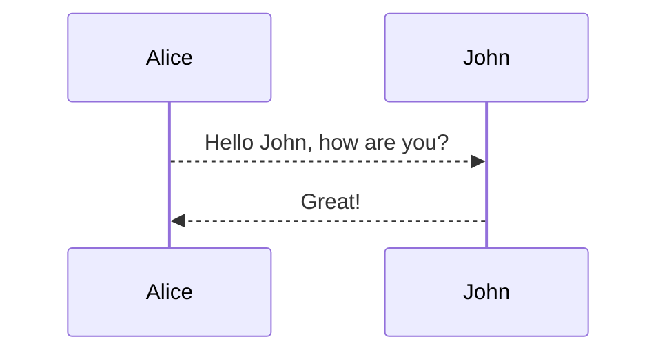

# read a book

**出售旧书**

1. Spring Cloud 与 Docker 微服务架构实战（第二版）<span style="color:red"> 10￥</span>
2. Java虚拟机  <span style="color:red"> 10￥</span>
3. 

  

## 技术和工具

### 知识面

1. 熟练掌握 javaSE 和 javaEE 相关知识，具有良好的面向对象编程思想，并熟悉常用的设计模式；
2. 熟练使用常见的 javaEE 开源框架，如 Struts2，Spring MVC，Spring，Hibernate，Mybatis，WebService；
3. 熟练操作 MySQL，Oracle 数据库，并能进行千万级数据库的优化，熟悉 MySQL 的集群的搭建；
4. 熟练使用 Linux常用的操作命令，熟悉 shell 脚本编程；
5. 熟悉 Hadoop 的系统架构，掌握 Hadoop HA 集群的搭建；
6. 熟悉 MapReduce 的原理和流程，并能用其 API 开发应用程序；
7. 熟悉 Zookeeper 的架构，运行的原理，如 HA；
8. 熟悉 Spark 的原理和流程，熟悉Scala语言并能用 Spark API 开发应用程序，熟悉 Spark streaming组件，并能用其开发实时计算系统，了解 `Spark 源码；
9. 熟悉 Storm 的原理和流程，并能使用 API 开发应用程序，熟悉 Strom+Kafka 实时流处理架构；
10. 熟悉 Hive 和 HBase 的系统架构，能使用 Hive 进行海量数据的统计分析，能根据需求实际HBase表，能对 Hive，HBase 进行调优；
11. 理解机器学习思想，熟悉 python 编程，熟悉 mahout，熟悉机器学习常用算法，如逻辑回归，朴素贝叶斯，神经网络算法；
12. 熟悉常见的开源日志收集框架 flume，Logstash，Kafka 消息列队，并能使用其实现不同场景的日志收集；
13. 熟悉大型网站高并发架构，熟悉Nginx，lvs等高并发技术并可以快速搭建，熟悉掌握Redis缓存数据库应用；
14. 熟悉全文搜索的思想，熟悉 Lucene ，Solor ，Elasticsearch 架构，并能搭建搜索引擎；
15. 熟悉分布式框架 Dubbo，并能搭建分布式系统；
16. 熟悉Maven ，SVN ，Jenkins等等工具使用和环境搭建；

17. map有哪几种?简要介绍HashMap散列算法,如何保证均衡,如何增长.
18. 简要介绍几种queue,和分别的用途.
19. Java线程的几种状态是?几种状态之间的流转关系是怎样的?
20. 继续上一问题,什么样的操作会导致线程进入阻塞状态.
21. 介绍下Callable和Future类的用法.
22. 介绍下ThreadFactory和Executors的关系,Executors.newFixedThreadPoll,Executors.newCachedThreadPool,Executors.newScheduledThreadPool分别应用在是场景?
23. 简述ExecutorsCompletionService类的作用和用法.
24. 什么是公平/非公平锁.
25. volatile关键字的意义和使用场景
26. 简述JVM内存结构.
27. 如何找到JVM里CPU使用过高的线程
28. 什么是阻塞和非阻塞IO
29. 什么情况下流式操作效率高于异步IO
30. 简述NIO模型,和常用的线程模型
31. 如果要序列化一个Java对象,有哪些序列化协议可用
32. 简单描述一个http请求报文
33. http常用返回状态码有哪些,至少列举3个,并描述其使用场景.
34. 介绍下http报文解析过程
35. 常用Linux命令有哪些,列举5个.
36. 使用Linux命令取一个每行以\t分隔的日志的第三列数字的总和
37. 如何建立Linux信任关系.
38. 浏览器请求流程
39. url mapping怎么实现的.


## 收藏博客

[java动态代理原理及解析 ](https://blog.csdn.net/scplove/article/details/52451899)

[Quartz任务调度框架 ](https://blog.csdn.net/scplove/article/details/52252637)


读后感记录

## How to learn

- write a demo
- add features 


## Effective Java

1. 对于非公有的方法，通常应该使用assertion来检查他们的参数，而不使用正常的检查语句
2. 只要能够不创建对象，就不要创建多余的对象。只要需要创建对象，就不要吝啬地创建它。它们并不矛盾，前者的目的是为了尽可能减少资源的占用，提高运行效率，后者是为了安全性（保护性拷贝）。

# 设计模式

**OOP的6大原则

先有设计原则后有设计模式

1. 单一职责

概要：一个类只负责一项职责

扩展：职责扩散时，视情况决定在类、方法上保持单一职责原则。

2. 里氏替换原则

概要：任何基类出现的地方，子类一定可以出现；子类可以扩展父类功能，但不能改变父类原有功能。

3. 依赖倒置原则

概要：高层模块不依赖于底层模块，二者都依赖其抽象；依赖于抽象，不依赖于具体。

扩展：依赖倒置的核心思想是：面向接口编程

4. 接口隔离原则

概要：客户端不应该依赖它不需要的接口，一个类对另一个类的依赖应该建立在最小接口上。


5. 迪米特原则（最少知道原则）

概要：一个对象应该对其它对象保持最少的了解（只与直接的朋友打交道）

扩展：类与类之间关系越密切，耦合度越大，应尽量降低类与类之间的耦合。

6. 开闭原则

概要：一个软件实体、模块、类、函数应该对扩展开放，对修改封闭。

扩展：用抽象构建框架，用实现扩展细节

7. 总结

**单一职责原则告诉我们实现类要职责单一；里氏替换原则告诉我们不要破坏继承体系；依赖倒置原则告诉我们要面向接口编程；接口隔离原则告诉我们在设计接口的时候要精简单一；迪米特法则告诉我们要降低耦合。而开闭原则是总纲，他告诉我们要对扩展开放，对修改关闭。**


模式：在特定场景下，针对特定类型问题的通用解决方案。


1. 代理模式是对象的结构模式。代理模式给某一个对象提供一个代理对象，并由代理对象控制对原对象的引用。
2. 使用工厂模式关心的是是否达到了降低耦合的目的，而不用关心到底使用的是“简单工厂模式，工厂模式，抽象工厂模式”中的哪一种。
3. 


# Java虚拟机

**jstatd 使用**

1. 创建policy文件 

```shellshe l
grant codebase "file:${java.home}/../lib/tools.jar" {   
    permission java.security.AllPermission;
};
```

2. 启动

```shell
jstatd -J-Djava.security.policy=jstatd.all.policy
```

3. 本地启动jvisualvm
4. 配置jstatd


**配置jvm内存**

```shell
@echo off

start "baseservice" java -jar -XX:MetaspaceSize=128m -XX:MaxMetaspaceSize=128m -Xms256m -Xmx256m -Xmn256m -Xss256k -XX:SurvivorRatio=8 -XX:+UseConcMarkSweepGC baseservice.jar
```

# JavaSE

**centos7 离线安装jdk**

1.查看JDK安装版本

[root@localhost ~]#java -version
java version *1.7.0_51*
OpenJDK Runtime Environment ( rhel-2.4.5.5.el7-x86_64 u51-b31)
OpenJDK 64-Bit Server VM (build 24.51-b03, mixed mode)
2.查找OpenJDK安装包
rpm -qa | grep openjdk
java-1.7.0-openjdk-headless-1.7.0.51-2.4.5.5.el7.x86_64
java-1.7.0-openjdk-1.7.0.51-2.4.5.5.el7.x86_64
3.卸载OpenJDK安装包

[root@localhost ~]#yum -y remove java-1.7.0-openjdk-headless.x86_64
[root@localhost ~]#yum -y remove java-1.7.0-openjdk.x86_64
4.下载JDK1.7安装包（jdk-7u65-linux-x64.rpm）
5.安装JDK1.7
[root@localhost 下载]#yum install jdk-7u65-linux-x64.rpm
6.配置环境变量
[root@localhost ~]#vim /etc/profile
在文件末尾添加如下内容
export JAVA_HOME=/usr/java/jdk1.7.0_65
export PATH=$PATH:$JAVA_HOME/bin
export CLASSPATH=.:$JAVA_HOME/lib/dt.jar:$JAVA_HOME/lib/tools.jar

[root@localhost ~]#source /etc/profile
7.查看安装结果
[root@localhost ~]#java -version
java version "1.7.0_65"
Java(TM) SE Runtime Environment (build 1.7.0_65-b17)

Java HotSpot(TM) 64-Bit Server VM (build 24.65-b04.mixed mode)


**拦截器**的运用

------

```java
public class IntrospectorDemo {
    private String name;
    public static void main(String[] args) throws Exception{
        IntrospectorDemo demo = new IntrospectorDemo();
        demo.setName( "Winter Lau" );
        // 如果不想把父类的属性也列出来的话， getBeanInfo 的第二个参数填写父类的信息
        BeanInfo bi = Introspector.getBeanInfo(demo.getClass(), Object. class );
        PropertyDescriptor[] props = bi.getPropertyDescriptors();
        for ( int i=0;i<props.length;i++){
            System.out.println(props[i].getName()+ "=" + props[i].getReadMethod().invoke(demo, null ));
        }
    }
    public String getName() {
        return name;
    }
    public void setName(String name) {
        this .name = name;
    }
}
```

**JDK环境变量问题**

在同一台电脑安装多个版本的jdk，然后又配置了环境变量，而后又因为其它原因需要更改环境变量，发现怎么改配置都不起效，可能需要到Windows/system32下删除一些java.exe, java.exe文件，但是也不一定能解决这个问题，如果依然不起效，接下来的操作是：到环境变量的path中，将jdk的配置移动到最前面，这时应该就会生效了。

**Java集合框架**

**前言：** 面试了几家公司，发现自己Java涉及到的知识面广度稍有，但是深度不够。故此重游Java基础中的重要模块。  


Collection

> List
>
> > ArrayList
> >
> > LinkedList
> >
> > Vector
> >
> > > Stack
>
> Set
>
> > HashSet
> >
> > Queue

Map

> HashTable
>
> HashMap
>
> TreeMap
>
> WeakHashMap


上面大体提到了一些常用的集合。  

**ClassLoader**

什么是ClassLoader

ClassLoader是一个抽象类，我们用它的实例对象来装载类 ，它负责将 Java 字节码装载到 JVM 中 ， 并使其成为 JVM 一部分。 JVM 的类动态装载技术能够在运行时刻动态地加载或者替换系统的某些功能模块，而不影响系统其他功能模块的正常运行。一般是通过类名读入一个class文件来装载这个类，（其它加载形式暂时没有研究过）。

ClassLoader装载过程

类装载就是寻找一个类或是一个接口的字节码文件并通过解析该字节码来构造代表这个类或是这个接口的 class 对象的过程 。在 Java 中，类装载器把一个类装入 Java 虚拟机中，要经过三个步骤来完成：装载、链接和初始化，其中链接又可以分成校验、准备和解析三步，除了解析外，其它步骤是严格按照顺序完成的，各个步骤的主要工作如下：

1. 装载：查找和导入类或接口的字节码；
2. 链接：执行下面的校验、准备和解析步骤，其中解析步骤是可以选择的
   1. 校验：检查导入类或接口的二进制数据的正确性；
   2. 准备：给类的静态变量分配并初始化存储空间；
   3. 解析：将符号引用转成直接引用;
3. 初始化：激活类的静态变量的初始化 Java 代码和静态 Java 代码块。

 

装载的实现

JVM 中类的装载是由 ClassLoader 和它的子类来实现的。 Java ClassLoader 是一个重要的 Java 运行时系统组件，它负责在运行时查找和装入 Java 字节码。

在 Java 中， ClassLoader 是一个抽象类，它在包 java.lang 中。可以这样说，只要了解了 ClassLoader 中的一些重要的方法，再结合上面所介绍的 JVM 中类装载的具体的过程，对动态装载类这项技术就有了一个比较大概的掌握，这些重要的方法包括以下几个：

1. loadCass 方法： loadClass(String name ,boolean resolve) 其中 name 参数指定了 JVM 需要的类的名称 , 该名称以类的全限定名表示，如 Java.lang.Object ； resolve 参数告诉方法是否需要解析类，在初始化类之前，应考虑类解析，并不是所有的类都需要解析，如果 JVM 只需要知道该类是否存在或找出该类的超类，那么就不需要解析。这个方法是 ClassLoader 的入口点。
2. defineClass 方法   这个方法接受类文件的字节数组并把它转换成 Class 对象。字节数组可以是从本地文件系统或网络装入的数据。它把字节码分析成运行时数据结构、校验有效性等等。
3. findSystemClass 方法   findSystemClass 方法从本地文件系统装入 Java 字节码。它在本地文件系统中寻找类文件，如果存在，就使用 defineClass 将字节数组转换成 Class 对象。当运行 Java 应用程序时 , 这是 JVM 正常装入类的缺省机制。
4. resolveClass 方法 resolveClass(Class c) 方法解析装入的类，如果该类已经被解析过那么将不做处理。当调用 loadClass 方法时 , 通过它的 resolve 参数决定是否要进行解析。
5. findLoadedClass 方法   当调用 loadClass 方法装入类时 , 调用 findLoadedClass 方法来查看 ClassLoader 是否已装入这个类 , 如果已装入 , 那么返回 Class 对象 , 否则返回 NULL 。如果强行装载已存在的类 , 将会抛出链接错误。 


# pinpoint

1. 下载

<https://github.com/naver/pinpoint/releases>

2. 部署

将web和collector的war包拷贝到tomcat的webapps下，启动tomcat。


# EFK 搭建使用

  Elasticsearch集群配置，集成spring boot，开发记录

**前文** 

全文检索的应用越来越广泛，几乎成了互联网应用的标配，商品搜索、日志分析、历史数据归档等等，各种场景都会涉及到大批量的数据，在全文检索方面，方案无外乎Lucene、Solr、Elasticsearch三种应用的较为广泛。es、solr的底层都依托于Lucene，但es比solr学习成本更低，由于其提供的RESTful API简单快捷，对互联网应用开发而言更是如虎添翼。

**ElasticSearch**

1. 下载

```shell
wget https://artifacts.elastic.co/downloads/elasticsearch/elasticsearch-6.5.4.rpm
```

2. 安装

3. rpm 安装

```shell
yum -y install elasticsearch-6.5.4.rpm
```

4. docker 安装

```shell
docker pull elasticsearch:6.4.3

docker run -d --name elasticsearch-1 -p 9200:9200 -p 9300:9300 -e "discovery.type=single-node" elasticsearch:6.4.3

```

5. rpm安装启动

```shell
systemctl start elasticsearch.service
systemctl enable elasticsearch.service
```

6. 非rpm安装启动

elasticsearch是不允许在root用户下操作的，如果在root用户下启动

```
cd elasticsearch-5.6.3
./bin/elasticsearch
```

会提示如下错误

```
java.lang.RuntimeException: can not run elasticsearch as root
```

因此我们可以在root用户下，创建新用户组及用户，在elasticsearch-5.6.3同级目录下

```shell
groupadd esgroup
useradd esuser -g esgroup
chown -R esuser:esgroup elasticsearch-5.6.3 
```

用户组及用户创建完毕，权限也提升之后，切换到esuser，启动elasticsearch即可（**此时ES的配置文件没有做任何更改**）

```shell
su - esuser（不能使用su esuser命令，否则刚才配置的java环境变量在esuser用户下不会生效）
cd elasticsearch-5.6.3
./bin/elasticsearch（可以在后面加 -d，即./bin/elasticsearch -d，可以后台运行）
```


7. 测试

```shell
curl http://localhost:9200/?pretty
# 打印出es信息如下
{
  "name" : "v1",
  "cluster_name" : "imjcker-es-cluster",
  "cluster_uuid" : "vAgh7MQVTqeu1_RkzT8ZdQ",
  "version" : {
    "number" : "6.5.4",
    "build_flavor" : "default",
    "build_type" : "rpm",
    "build_hash" : "d2ef93d",
    "build_date" : "2018-12-17T21:17:40.758843Z",
    "build_snapshot" : false,
    "lucene_version" : "7.5.0",
    "minimum_wire_compatibility_version" : "5.6.0",
    "minimum_index_compatibility_version" : "5.0.0"
  },
  "tagline" : "You Know, for Search"
}
```


8. 集群

```shell
vi /etc/elasticsearch/elasticsearch.yml
# 修改配置
# 1.集群名字，每个节点统一
cluster.name: imjcker-es-cluster
# 2.节点名字，每个节点不一样
node.name: node-1
# 3.节点IP, 改为 0.0.0.0
network.host: 0.0.0.0
# 4.集群节点配置，改为给个节点的IP地址
discovery.zen.ping.unicast.hosts: ["45.32.93.126","45.77.123.20","66.42.102.132"]
```

9. 开放端口

```shell
# 如果是开发环境，不在乎安全，可直接关闭防火墙
systemctl stop firewalld
systemctl disable firewalld

# 不关闭防火墙，开放端口
# 开放elasticsearch默认的客户端端口和集群通信端口
firewall-cmd --zone=public --add-port=9200/tcp --permanent
firewall-cmd --zone=public --add-port=9300/tcp --permanent
firewall-cmd --reload
```

10. 重启服务

```shell
# 重启每个节点
systemctl restart elasticsearch
```

11. 测试

```shell
curl http://localhost:9200/_cluster/health?pretty
# 打印内容类似如下
{
  "cluster_name" : "imjcker-es-cluster",
  "status" : "green",
  "timed_out" : false,
  "number_of_nodes" : 3,
  "number_of_data_nodes" : 3,
  "active_primary_shards" : 0,
  "active_shards" : 0,
  "relocating_shards" : 0,
  "initializing_shards" : 0,
  "unassigned_shards" : 0,
  "delayed_unassigned_shards" : 0,
  "number_of_pending_tasks" : 0,
  "number_of_in_flight_fetch" : 0,
  "task_max_waiting_in_queue_millis" : 0,
  "active_shards_percent_as_number" : 100.0
}
```


12. 工具

13. 建议安装 [Elasticsearch Head](https://chrome.google.com/webstore/detail/elasticsearch-head/ffmkiejjmecolpfloofpjologoblkegm) 浏览器插件，便于开发查询数据。
14. es集群管理 https://github.com/lmenezes/elasticsearch-kopf
15. es集群监控 https://github.com/lukas-vlcek/bigdesk 
16. 中文分词器 ik-analyzer <https://github.com/medcl/elasticsearch-analysis-ik>


13. 学习

14. ES集群的安装部署
15. ES术语概念的学习
16. ES索引学习
17. ES查询查询语法学习
18. 集成到特定的spring boot版本中
19. 高亮查询问题的解决（特定版本）
20. 解决满足业务的查询问题（主要是涉及到权限问题）

21. 查询解决方案

说明：<p style="color:red">只要前一步骤查询不为空就结束查询，否则进入下一步查询</p>

1. matchPhraseQuery（不分词查询）slop设置匹配度
2. matchQuery（分词匹配查询）
3. termQuery（完全匹配查询）
4. findAllByContentContains（利用spring boot自带功能ElasticsearchRepository查询，类似于jpa）

5. 代码

```java
public Page search(String ajbm, String keyword, Pageable pageable) {
        //在辅助工具中查询
        if (StringUtils.isEmpty(ajbm)) {
            Page<Doc> page = matchPhraseQuery(keyword, pageable);
            if (page != null) {
                return page;
            } else {
                page = matchQuery(keyword, "", pageable);
                if (page == null)
                    page = termQuery(keyword, pageable);
                if (page == null) {
                    Page<Doc> docPage = docEsRepository.findAllByContentContains(keyword, pageable);
                    if (docPage != null) {
                        page = docPage.map(source -> source);
                    }
                }
            }
            return page;
        }
}
```

16. 配置说明

17. 配置1

配置文件2.0版

配置文件位于%ES_HOME%/config/elasticsearch.yml文件中，用Editplus打开它，你便可以进行配置。
所有的配置都可以使用环境变量，例如：
node.rack: ${RACK_ENV_VAR}
表示环境变量中有一个RACK_ENV_VAR变量。
下面列举一下elasticsearch的可配置项：

1. 集群名称，默认为elasticsearch：
   cluster.name: elasticsearch
2. 节点名称，es启动时会自动创建节点名称，但你也可进行配置：
   node.name: "Franz Kafka"
3. 是否作为主节点，每个节点都可以被配置成为主节点，默认值为true：
   node.master: true
4. 是否存储数据，即存储索引片段，默认值为true：
   node.data: true
   master和data同时配置会产生一些奇异的效果：
   1) 当master为false，而data为true时，会对该节点产生严重负荷；
   2) 当master为true，而data为false时，该节点作为一个协调者；
   3) 当master为false，data也为false时，该节点就变成了一个负载均衡器。
   你可以通过连接http://localhost:9200/_cluster/health或者http://localhost:9200/_cluster/nodes，或者使用插件http://github.com/lukas-vlcek/bigdesk或http://mobz.github.com/elasticsearch-head来查看集群状态。
5. 每个节点都可以定义一些与之关联的通用属性，用于后期集群进行碎片分配时的过滤：
   node.rack: rack314
6. 默认情况下，多个节点可以在同一个安装路径启动，如果你想让你的es只启动一个节点，可以进行如下设置：
   node.max_local_storage_nodes: 1
7. 设置一个索引的碎片数量，默认值为5：
   index.number_of_shards: 5
8. 设置一个索引可被复制的数量，默认值为1：
   index.number_of_replicas: 1
   当你想要禁用公布式时，你可以进行如下设置：
   index.number_of_shards: 1
   index.number_of_replicas: 0
   这两个属性的设置直接影响集群中索引和搜索操作的执行。假设你有足够的机器来持有碎片和复制品，那么可以按如下规则设置这两个值：
   1) 拥有更多的碎片可以提升索引执行能力，并允许通过机器分发一个大型的索引；
   2) 拥有更多的复制器能够提升搜索执行能力以及集群能力。
   对于一个索引来说，number_of_shards只能设置一次，而number_of_replicas可以使用索引更新设置API在任何时候被增加或者减少。
   ElasticSearch关注加载均衡、迁移、从节点聚集结果等等。可以尝试多种设计来完成这些功能。
   可以连接http://localhost:9200/A/_status来检测索引的状态。
9. 配置文件所在的位置，即elasticsearch.yml和logging.yml所在的位置：
   path.conf: /path/to/conf
10. 分配给当前节点的索引数据所在的位置：
    path.data: /path/to/data
    可以可选择的包含一个以上的位置，使得数据在文件级别跨越位置，这样在创建时就有更多的自由路径，如：
    path.data: /path/to/data1,/path/to/data2
11. 临时文件位置：
    path.work: /path/to/work
12. 日志文件所在位置：
    path.logs: /path/to/logs
13. 插件安装位置：
    path.plugins: /path/to/plugins
14. 插件托管位置，若列表中的某一个插件未安装，则节点无法启动：
    plugin.mandatory: mapper-attachments,lang-groovy
15. JVM开始交换时，ElasticSearch表现并不好：你需要保障JVM不进行交换，可以将bootstrap.mlockall设置为true禁止交换：
    bootstrap.mlockall: true
    请确保ES_MIN_MEM和ES_MAX_MEM的值是一样的，并且能够为ElasticSearch分配足够的内在，并为系统操作保留足够的内存。
16. 默认情况下，ElasticSearch使用0.0.0.0地址，并为http传输开启9200-9300端口，为节点到节点的通信开启9300-9400端口，也可以自行设置IP地址：
    network.bind_host: 192.168.0.1
17. publish_host设置其他节点连接此节点的地址，如果不设置的话，则自动获取，publish_host的地址必须为真实地址：
    network.publish_host: 192.168.0.1
18. bind_host和publish_host可以一起设置：
    network.host: 192.168.0.1
19. 可以定制该节点与其他节点交互的端口：
    transport.tcp.port: 9300
20. 节点间交互时，可以设置是否压缩，转为为不压缩：
    transport.tcp.compress: true
21. 可以为Http传输监听定制端口：
    http.port: 9200
22. 设置内容的最大长度：
    http.max_content_length: 100mb
23. 禁止HTTP
    http.enabled: false
24. 网关允许在所有集群重启后持有集群状态，集群状态的变更都会被保存下来，当第一次启用集群时，可以从网关中读取到状态，默认网关类型（也是推荐的）是local：
    gateway.type: local
25. 允许在N个节点启动后恢复过程：
    gateway.recover_after_nodes: 1
26. 设置初始化恢复过程的超时时间：
    gateway.recover_after_time: 5m
27. 设置该集群中可存在的节点上限：
    gateway.expected_nodes: 2
28. 设置一个节点的并发数量，有两种情况，一种是在初始复苏过程中：
    cluster.routing.allocation.node_initial_primaries_recoveries: 4
    另一种是在添加、删除节点及调整时：
    cluster.routing.allocation.node_concurrent_recoveries: 2
29. 设置复苏时的吞吐量，默认情况下是无限的：
    indices.recovery.max_size_per_sec: 0
30. 设置从对等节点恢复片段时打开的流的数量上限：
    indices.recovery.concurrent_streams: 5
31. 设置一个集群中主节点的数量，当多于三个节点时，该值可在2-4之间：
    discovery.zen.minimum_master_nodes: 1
32. 设置ping其他节点时的超时时间，网络比较慢时可将该值设大：
    discovery.zen.ping.timeout: 3s
    http://elasticsearch.org/guide/reference/modules/discovery/zen.html上有更多关于discovery的设置。
33. 禁止当前节点发现多个集群节点，默认值为true：
    discovery.zen.ping.multicast.enabled: false
34. 设置新节点被启动时能够发现的主节点列表（主要用于不同网段机器连接）：
    discovery.zen.ping.unicast.hosts: ["host1", "host2:port", "host3[portX-portY]"]
    35.设置是否可以通过正则或者_all删除或者关闭索引
    action.destructive_requires_name 默认false 允许 可设置true不允许

35. 配置2

elasticsearch的config文件夹里面有两个配置文件：elasticsearch.yml和logging.yml，第一个是es的基本配置文件，第二个是日志配置文件，es也是使用log4j来记录日志的，所以logging.yml里的设置按普通log4j配置文件来设置就行了。下面主要讲解下elasticsearch.yml这个文件中可配置的东西。

cluster.name: elasticsearch
配置es的集群名称，默认是elasticsearch，es会自动发现在同一网段下的es，如果在同一网段下有多个集群，就可以用这个属性来区分不同的集群。

node.name: "Franz Kafka"
节点名，默认随机指定一个name列表中名字，该列表在es的jar包中config文件夹里name.txt文件中，其中有很多作者添加的有趣名字。

node.master: true
指定该节点是否有资格被选举成为node，默认是true，es是默认集群中的第一台机器为master，如果这台机挂了就会重新选举master。

node.data: true
指定该节点是否存储索引数据，默认为true。

index.number_of_shards: 5
设置默认索引分片个数，默认为5片。

index.number_of_replicas: 1
设置默认索引副本个数，默认为1个副本。

path.conf: /path/to/conf
设置配置文件的存储路径，默认是es根目录下的config文件夹。

path.data: /path/to/data
设置索引数据的存储路径，默认是es根目录下的data文件夹，可以设置多个存储路径，用逗号隔开，例：
path.data: /path/to/data1,/path/to/data2

path.work: /path/to/work
设置临时文件的存储路径，默认是es根目录下的work文件夹。

path.logs: /path/to/logs
设置日志文件的存储路径，默认是es根目录下的logs文件夹

path.plugins: /path/to/plugins
设置插件的存放路径，默认是es根目录下的plugins文件夹

bootstrap.mlockall: true
设置为true来锁住内存。因为当jvm开始swapping时es的效率会降低，所以要保证它不swap，可以把ES_MIN_MEM和ES_MAX_MEM两个环境变量设置成同一个值，并且保证机器有足够的内存分配给es。同时也要允许elasticsearch的进程可以锁住内存，linux下可以通过`ulimit -l unlimited`命令。

network.bind_host: 192.168.0.1
设置绑定的ip地址，可以是ipv4或ipv6的，默认为0.0.0.0。

network.publish_host: 192.168.0.1
设置其它节点和该节点交互的ip地址，如果不设置它会自动判断，值必须是个真实的ip地址。

network.host: 192.168.0.1
这个参数是用来同时设置bind_host和publish_host上面两个参数。

transport.tcp.port: 9300
设置节点间交互的tcp端口，默认是9300。

transport.tcp.compress: true
设置是否压缩tcp传输时的数据，默认为false，不压缩。

http.port: 9200
设置对外服务的http端口，默认为9200。

http.max_content_length: 100mb
设置内容的最大容量，默认100mb

http.enabled: false
是否使用http协议对外提供服务，默认为true，开启。

gateway.type: local
gateway的类型，默认为local即为本地文件系统，可以设置为本地文件系统，分布式文件系统，hadoop的HDFS，和amazon的s3服务器，其它文件系统的设置方法下次再详细说。

gateway.recover_after_nodes: 1
设置集群中N个节点启动时进行数据恢复，默认为1。

gateway.recover_after_time: 5m
设置初始化数据恢复进程的超时时间，默认是5分钟。

gateway.expected_nodes: 2
设置这个集群中节点的数量，默认为2，一旦这N个节点启动，就会立即进行数据恢复。

cluster.routing.allocation.node_initial_primaries_recoveries: 4
初始化数据恢复时，并发恢复线程的个数，默认为4。

cluster.routing.allocation.node_concurrent_recoveries: 2
添加删除节点或负载均衡时并发恢复线程的个数，默认为4。

indices.recovery.max_size_per_sec: 0
设置数据恢复时限制的带宽，如入100mb，默认为0，即无限制。

indices.recovery.concurrent_streams: 5
设置这个参数来限制从其它分片恢复数据时最大同时打开并发流的个数，默认为5。

discovery.zen.minimum_master_nodes: 1
设置这个参数来保证集群中的节点可以知道其它N个有master资格的节点。默认为1，对于大的集群来说，可以设置大一点的值（2-4）

discovery.zen.ping.timeout: 3s
设置集群中自动发现其它节点时ping连接超时时间，默认为3秒，对于比较差的网络环境可以高点的值来防止自动发现时出错。

discovery.zen.ping.multicast.enabled: false
设置是否打开多播发现节点，默认是true。

discovery.zen.ping.unicast.hosts: ["host1", "host2:port", "host3[portX-portY]"]
设置集群中master节点的初始列表，可以通过这些节点来自动发现新加入集群的节点。

下面是一些查询时的慢日志参数设置
index.search.slowlog.level: TRACE
index.search.slowlog.threshold.query.warn: 10s
index.search.slowlog.threshold.query.info: 5s
index.search.slowlog.threshold.query.debug: 2s
index.search.slowlog.threshold.query.trace: 500ms

index.search.slowlog.threshold.fetch.warn: 1s
index.search.slowlog.threshold.fetch.info: 800ms
index.search.slowlog.threshold.fetch.debug:500ms
index.search.slowlog.threshold.fetch.trace: 200ms


**Kibana**

1. 下载

```shell
wget https://artifacts.elastic.co/downloads/kibana/kibana-6.5.4-x86_64.rpm
```

2. 安装

```shell
yum -y install kibana-6.5.4-x86_64.rpm
```

3. 配置

```shell
vi /etc/kibana/kibana.yml

server.host: "0.0.0.0"
elasticsearch.url: "http://elasticsearch-host:9200"

```

4. 启动

```shell
systemctl start kibana
```

5. 访问

http://kibanahost:5601


**Filebeat**

1. 下载

```shell
wget https://artifacts.elastic.co/downloads/beats/filebeat/filebeat-6.5.4-x86_64.rpm
```

2. 安装

```shell
yum -y install filebeat-6.5.4-x86_64.rpm
```

3. 配置

```shell
vi /etc/filebeat/filebeat.yml

```

```yaml
enabled: true
paths: /log-directory/*.log
output.elasticsearch:
  hosts: ["http://xxxx.imjcker.com:9200"]

```

4. 启动

```shell
systemctl start filebeat
```

5. 测试

到kibana的管理界面搜索关键字


# Git 操作使用

1. 配置GitHub账户信息

$ git config --global user.name "John Doe"
$ git config --global user.email johndoe@example.com

1. create ssh keygen 

   > $ ssh-keygen -t rsa -C "youremail@example.com"
   > replace email address with your account.

2. add repository to github.

   > git remote add origin git@github.com:helloalanturing/repo-name.git
   > "origin" is an alias for the real repository.

3. push files to github

   > git push -u origin master
   > for the first time.
   > after that, you don't need the parameter "-u", so just "git push origin master"

4. 创建本地Git仓库

5. cd 到仓库目录,或者mkdir一个目录,并cd到这个目录.
   执行命令 git init

6. 添加文件到仓库,(创建仓库后,即使目录下有文件,也不在仓库内,需要执行添加命令)
   git add file    (file可以是目录,或通配符)

7. 添加文件命令后需要执行提交命令
   git commit -m "some message"

8. 删除本地仓库 find . -name ".git" | xargs rm -Rf 可分2步骤,先找到文件,再删除文件.

9. 提交代码到远程仓库

10. 创建ssh key
    $ ssh-keygen -t rsa -C "youremail@example.com"

11. id_rsa.pub下的公钥复制添加到GitHub上

12. 创建远程仓库
    在GitHub上new 一个repository
    注意:在创建远程仓库时,如果勾选了创建README.md,在与本地仓库关联前,
    一定要先pull (git pull origin master --allow-unrelated-histories)远程仓库到本地,不然
    ​    直接提交会产生冲突,导致不必要的麻烦.

13. 关联本地仓库到远程仓库
    $ git remote add origin git@github.com:michaelliao/learngit.git

14. 推送内容到远程仓库
    git push -u origin master(第一次)
    git push origin master(以后)

    when push was refused
    try: 1.git fetch origin 2.git merge origin BRANCH.
    ​    or simply do: git pull origin BRANCH

**更改仓库链接**

git remote set-url origin https://github.com/USERNAME/REPOSITORY.git

**删除GitHub上多余的文件及目录**

**前言**

&emsp; &emsp; 上传项目到GitHub上时，误把本地IDE的配置文件上传了上去，以下是Git的删除命令。 

```shell
#删除src及下级目录的所有文件
git rm -r --cached src/\*

#提交操作
git commit -m "删除说明"

#推送到GitHub服务器
git push origin master

```

4. 上传项目到GitHub

5. 检查本地是否安装Git

> git —version

1. 检查本地是否存在SSH公钥和密钥

> ls  ~/.ssh

如果存在*id_rsa* 和*id_rsa.pub* 说明已经存在。跳至`添加密钥到GitHub`

1. 创建SSH Key
2. 执行命令

> ssh-keygen -t rsa -b 4096 -C "你注册GitHub的邮箱"

1. 一直敲回车键

2. 添加密钥到GitHub

   进入GitHub，点击头像，选择`settings`

   	然后选择`SSH and GPG keys`
   	
   	然后`New SSH key`
   	
   	Title中输入邮箱
   	
   	key中输入刚才本地创建SSH key生成的`id_rsa.pub`文件的内容，复制方法为：
   	
   	pbcopy < ~/.ssh/id_rsa.pub	//执行此命令拷贝文件下的内容
   	
   	最后粘贴到key项。点击继续。

3. 测试是否关联好本地和GitHub

> ssh -T git@github.com

遇到选择选`yes`看到

> Hi xxxxx! You've successfully authenticated, but GitHub does not provide shell access.

说明关联成功。

1. 关联本地项目到GitHub

待续。。。

```java
public class Github{
    public static void main(String[] args){
        System.out.println("Hello world");
    }
}
```

5. 删除分支

```shell
git push origin -d branch_name
```

6. **常用命令**

| 功能                      | 命令                                  |
| :------------------------ | :------------------------------------ |
| 添加文件/更改到暂存区     | git add filename                      |
| 添加所有文件/更改到暂存区 | git add .                             |
| 提交                      | git commit -m msg                     |
| 从远程仓库拉取最新代码    | git pull origin master                |
| 推送到远程仓库            | git push origin master                |
| 查看配置信息              | git config --list                     |
| 查看文件列表              | git ls-files                          |
| 比较工作区和暂存区        | git diff                              |
| 比较暂存区和版本库        | git diff --cached                     |
| 比较工作区和版本库        | git diff HEAD                         |
| 从暂存区移除文件          | git reset HEAD filename               |
| 查看本地远程仓库配置      | git remote -v                         |
| 回滚                      | git reset --hard 提交SHA              |
| 强制推送到远程仓库        | git push -f origin master             |
| 修改上次 commit           | git commit --amend                    |
| 推送 tags 到远程仓库      | git push --tags                       |
| 推送单个 tag 到远程仓库   | git push origin [tagname]             |
| 删除远程分支              | git push origin --delete [branchName] |
| 远程空分支（等同于删除）  | git push origin :[branchName]         |
| 查看所有分支历史          | gitk --all                            |
| 按日期排序显示历史        | gitk --date-order                     |

7. Q&A

   如何解决git中文乱码，git ls-files 中文文件名乱码问题？

   在~/.gitconfig中添加如下内容

   ```shell
   [core]
      quotepath = false
   [gui]
      encoding = utf-8
   [i18n]
      commitencoding = utf-8
   [svn]
      pathnameencoding = utf-8
   ```

8. 如何处理本地有更改需要从服务器合入新代码的情况？

   ```shell
   git stash
   git pull
   git stash pops
   tash
   ```

9. stash

查看 stash 列表：

```
git stash list
```

查看某一次 stash 的改动文件列表（不传最后一个参数默认显示最近一次）：

```
git stash show stash@{0}
```

以 patch 方式显示改动内容

```
git stash show -p stash@{0}
```

10. 如何合并 fork 的仓库的上游更新？

```
git remote add upstream https://upstream-repo-url
git fetch upstream
git merge upstream/master
```

11. 如何通过 TortoiseSVN 带的 TortoiseMerge.exe 处理 git 产生的 conflict？

* 将 TortoiseMerge.exe 所在路径添加到 `path` 环境变量。

* 运行命令 `git config --global merge.tool tortoisemerge` 将 TortoiseMerge.exe 设置为默认的 merge tool。

* 在产生 conflict 的目录运行 `git mergetool`，TortoiseMerge.exe 会跳出来供你 resolve conflict。

  > 也可以运行 `git mergetool -t vimdiff` 使用 `-t` 参数临时指定一个想要使用的 merge tool。

12. 不想跟踪的文件已经被提交了，如何不再跟踪而保留本地文件？

`git rm --cached /path/to/file`，然后正常 add 和 commit 即可。

13. 如何不建立一个没有 parent 的 branch？

```
git checkout --orphan newbranch
```

此时 `git branch` 是不会显示该 branch 的，直到你做完更改首次 commit。比如你可能会想建立一个空的 gh-pages branch，那么：

```
git checkout --orphan gh-pages
git rm -rf .
// add your gh-pages branch files
git add .
git commit -m "init commit"
```

14. submodule 的常用命令

**添加 submodule**

```
git submodule add git@github.com:philsquared/Catch.git Catch
```

这会在仓库根目录下生成如下 .gitmodules 文件并 clone 该 submodule 到本地。

```
[submodule "Catch"]
path = Catch
url = git@github.com:philsquared/Catch.git
```

**更新 submodule**

```
git submodule update
```

当 submodule 的 remote 有更新的时候，需要

```
git submodule update --remote
```

**删除 submodule**

在 .gitmodules 中删除对应 submodule 的信息，然后使用如下命令删除子模块所有文件：

```
git rm --cached Catch
```

**clone 仓库时拉取 submodule**

```
git submodule update --init --recursive
```

15. 删除远程 tag

```
git tag -d v0.0.9
git push origin :refs/tags/v0.0.9
```

或

```
git push origin --delete tag [tagname]
```

16. 清除未跟踪文件

```
git clean
```

可选项：

| 选项                    | 含义                             |
| ----------------------- | -------------------------------- |
| -q, --quiet             | 不显示删除文件名称               |
| -n, --dry-run           | 试运行                           |
| -f, --force             | 强制删除                         |
| -i, --interactive       | 交互式删除                       |
| -d                      | 删除文件夹                       |
| -e, --exclude <pattern> | 忽略符合 <pattern> 的文件        |
| -x                      | 清除包括 .gitignore 里忽略的文件 |
| -X                      | 只清除 .gitignore 里忽略的文件   |

17. 忽略文件属性更改

因为临时需求对某个文件 chmod 了一下，结果这个就被记为了更改，有时候这是想要的，有时候这会造成困扰。

```
git config --global core.filemode false
```

18. patch

将未添加到暂存区的更改生成 patch 文件：

```
git diff > demo.patch
```

将已添加到暂存区的更改生成 patch 文件：

```
git diff --cached > demo.patch
```

合并上面两条命令生成的 patch 文件包含的更改：

```
git apply demo.patch

```

将从 HEAD 之前的 3 次 commit 生成 3 个 patch 文件：

（HEAD 可以换成 sha1 码）

```
git format-patch -3 HEAD

```

生成 af8e2 与 eaf8e 之间的 commits 的 patch 文件：

（注意 af8e2 比 eaf8e 早）

```
git format-patch af8e2..eaf8e

```

合并 format-patch 命令生成的 patch 文件：

```
git am 0001-Update.patch

```

与 `git apply` 不同，这会直接 add 和 commit。

19. 只下载最新代码

```
git clone --depth 1 git://xxxxxx

```

这样 clone 出来的仓库会是一个 shallow 的状态，要让它变成一个完整的版本：

```
git fetch --unshallow

```

或

```
git pull --unshallow

```

20. 基于某次 commit 创建分支

```sh
git checkout -b test 5234ab

```

表示以 commit hash 为 `5234ab` 的代码为基础创建分支 `test`。

21. 恢复单个文件到指定版本

```sh
git reset 5234ab MainActivity.java

```

恢复 MainActivity.java 文件到 commit hash 为 `5234ab` 时的状态。

22. 设置全局 hooks

```sh
git config --global core.hooksPath C:/Users/mazhuang/git-hooks

```

然后把对应的 hooks 文件放在最后一个参数指定的目录即可。

比如想要设置在 commit 之前如果检测到没有从服务器同步则不允许 commit，那在以上目录下建立文件 pre-commit，内容如下：

```sh
#!/bin/sh

CURRENT_BRANCH=$(git rev-parse --abbrev-ref HEAD)

git fetch origin $CURRENT_BRANCH

HEAD=$(git rev-parse HEAD)
FETCH_HEAD=$(git rev-parse FETCH_HEAD)

if [ "$FETCH_HEAD" = "$HEAD" ];
then
    echo "Pre-commit check passed"
    exit 0
fi

echo "Error: you need to update from remote first"

exit 1

```

23. 查看某次 commit 的修改内容

```sh
git show <commit-hash-id>

```

24. 查看某个文件的修改历史

```sh
git log -p <filename>

```

25. 查看最近两次的修改内容

```sh
git log -p -2

```

26. 应用已存在的某次更改 / merge 某一个 commit

```sh
git cherry-pick <commit-hash-id>

```

cherry-pick 有更多详细的用法，可以参见帮助文档。

27. 命令行自动补全

在 shell 里加载 git-completion 系列脚本，详见 <https://github.com/git/git/tree/master/contrib/completion>

28. 文件每一行变更明细

```sh
git blame <filename>

```

29. 找回曾经的历史

```sh
git reflog

```

列出 HEAD 曾指向过的一系列 commit，它们只存在于本机，不是版本仓库的一部分。

还有：

```sh
git fsck

```

30. 记住 http(s) 方式的用户名密码

在有些情况下无法使用 git 协议，比如公司的 git 服务器设置了 IP 白名单，只能在公司内网使用 ssh，那么在外面就只能使用 http(s) 上传下载源码了，但每次都手动输入用户名/密码特别惨，于是乎就记住吧。

设置记住密码（默认 15 分钟）：

```sh
git config --global credential.helper cache

```

自定义记住的时间（如下面是一小时）：

```sh
git config credential.helper 'cache --timeout=3600'

```

长期存储密码：

```sh
git config --global credential.helper store

```

31. git commit 使用 vim 编辑 commit message 中文乱码

这个问题在 Windows 下出现了，没找到能完美解决的办法，一种方法是在 vim 打开后输入：

```sh
:set termencoding=GBK

```

这就有点太麻烦了，折衷的方法是改为使用 gVim 或其它你喜欢的编辑器来编辑 commit message：

```sh
git config --global core.editor gvim

```

另外在升级 Vim 到 8.1 之后，由于 PATH 环境变量里加的还是 vim80 文件夹，导致 git commit 时提示：

```
error: cannot spawn gvim: No such file or directory
error: unable to start editor 'gvim'
Please supply the message using either -m or -F option.

```

使用 `which gvim` 查看：

```
$ which gvim
/usr/bin/which: no gvim in xxxxxxx

```

将 PATH 里添加的 vim80 路径改为 vim81 后解决。

32. git log 中文乱码

只在 Windows 下遇到。

```sh
git config --global i18n.logoutputencoding gbk

```

编辑 git 安装目录下 etc/profile 文件，在最后添加如下内容：

```
export LESSCHARSET=utf-8

```

33. git diff 中文乱码

只在 Windows 下遇到，目前尚未找到有效办法。

34. 统计代码行数

CMD 下直接执行可能失败，可以在右键，Git Bash here 里执行。

35. 统计某人的代码提交量

```sh
git log --author="$(git config --get user.name)" --pretty=tformat: --numstat | gawk '{ add += $1 ; subs += $2 ; loc += $1 - $2 } END { printf "added lines: %s removed lines : %s total lines: %s\n",add,subs,loc }'

```

36. 仓库提交排名前 5

如果看全部，去掉 head 管道即可。

```sh
git log --pretty='%aN' | sort | uniq -c | sort -k1 -n -r | head -n 5
```

37. 仓库提交者（邮箱）排名前 5

这个统计可能不太准，可能有同名。

```sh
git log --pretty=format:%ae | gawk -- '{ ++c[$0]; } END { for(cc in c) printf "%5d %s\n",c[cc],cc; }' | sort -u -n -r | head -n 5

```

38. 贡献者排名

```sh
git log --pretty='%aN' | sort -u | wc -l

```

39. 提交数统计

```sh
git log --oneline | wc -l

```

40. 修改文件名时的大小写问题

修改文件名大小写时，默认会被忽略（在 Windows 下是这样），让 git 对大小写敏感的方法：

```sh
git config --global core.ignorecase false

```

或者使用 `git mv oldname newname` 也是可以的。

41. 修复 gitk 在 macOS 下显示模糊的问题

gitk 很方便，但是在 Mac 系统下默认显示很模糊，影响体验。

根据网上搜索的结果，解决方法有两种，我采用第一种解决，第二种未尝试。

方法一：

1. 重新启动机器，按 command + R 等 Logo 和进度条出现，会进入 Recovery 模式，选择顶部的实用工具——终端，运行以下命令：

   ```sh
   csrutil disable
   
   ```

2. 重新启动机器。

3. 编辑 Wish 程序的 plist，启动高分辨率屏支持。

   ```
   sudo gvim /System/Library/Frameworks/Tk.framework/Versions/Current/Resources/Wish.app/Contents/Info.plist
   
   ```

   在最后的 </dict> 前面加上以下代码

   ```sh
   <key>NSHighResolutionCapable</key>
   <true/>
   
   ```

4. 更新 Wish.app。

   ```sh
   sudo touch Wish.app
   
   ```

5. 再次用 1 步骤的方法进入 Recovery 模式，执行 `csrutil enable` 启动对系统文件保护，再重启即可。

方法二：

```sh
brew cask install retinizer
open /System/Library/Frameworks/Tk.framework/Versions/Current/Resources/

```

打开 retinizer，将 Wish.app 拖到 retinizer 的界面。

**搭建gitlab**

```shell
docker pull gitlab/gitlab-ce

```

docker-compose

```yaml
web:
  image: 'gitlab/gitlab-ce:latest'
  restart: always
  hostname: 'gitlab.example.com'
  environment:
    GITLAB_OMNIBUS_CONFIG: |
      external_url 'https://gitlab.example.com'
      # Add any other gitlab.rb configuration here, each on its own line
  ports:
    - '80:80'
    - '443:443'
    - '22:22'
  volumes:
    - '/srv/gitlab/config:/etc/gitlab'
    - '/srv/gitlab/logs:/var/log/gitlab'
    - '/srv/gitlab/data:/var/opt/gitlab'
```


# Maven

Maven使用心得——一个程序小白自学使用maven的心得及体验记录

1. maven是什么

其实我最初也不知道maven是什么，只知道群里的人聊得挺热闹的，但是我们公司不用maven，用ant编译项目，我连ant也不懂，反正只管写CRUD，改bug，这就是一个刚毕业的程序员进错公司干的事。

不行，我不能这样，不能在这里颓废，但是我又有什么能力跳槽呢？没有经验，家里还负债累累。那就蛰伏吧，自学前卫的技术，慢慢学，翅膀硬了就飞。

2. 安装maven

我使用的是Mac，所以：

```
vi ~/.bash_profile

export M2_HOME=/Users/alanturing/apache-maven-3.5.0

export PATH=$PATH:$M2_HOME/bin

source ~/.bash_profile
```

搞定。

不出意外的话，使用`mvn -v`就能检查是否安装成功了。

3. maven做什么

跟大多数人一样，最初觉得拿maven导包很不错，也认为maven就这点功能了。不要笑，我真是是个小白。

我以前从来不知道包冲突这回事，知道后来发现怎么也编译不过去。

原来还有包冲突这回事啊，好吧，get到了一个新技能。

```
<exclusion>是个好东西。
```

4. Maven 中央仓库 Repository

```
 <mirror>
    <id>nexus-aliyun</id>
    <mirrorOf>*</mirrorOf>
    <name>Nexus aliyun</name>
    <url>http://maven.aliyun.com/nexus/content/groups/public</url>
</mirror> 
```

5. Maven 本地安装

```shell
mvn install:install-file -Dfile=E:\sword-lang-2.0.0.jar -DgroupId=sword.org -DartifactId=sword-lang -Dversion=2.0.0 -Dpackaging=jar

mvn install:install-file -Dfile=E:\wechat4j-1.3.1.jar -DgroupId=sword.org -DartifactId=wechat4j -Dversion=1.3.1 -Dpackaging=jar

#如果失败，把每个参数用双引号括起来
mvn install:install-file "-Dfile=D:/wsinforExtract.jar" "-DgroupId=com.cyvation" "-DartifactId=wsinforExtract-092701" "-Dversion=1.0.0" "-Dpackaging=jar"
```

6. maven 编译打包属性到manifest文件中

```xml
<plugin>
    <artifactId>maven-jar-plugin</artifactId>
    <version>3.0.2</version>
    <configuration>
        <archive>
            <manifest>
                <addClasspath>true</addClasspath>
            </manifest>
            <manifestEntries>
                <Main-Class>
                    com.imjcker.App
                </Main-Class>
            </manifestEntries>
        </archive>
    </configuration>
</plugin>
```

7. 指定打包路径

```xml
<configuration>
    <outputDirectory>D:\</outputDirectory>
</configuration>
```


# Tesseract

PDF --> tiff --> 双层PDF

1. imagemagick 转PDF为TIFF
2. tesseract 转TIFF为双层PDF

3. 安装tesseract

```shell
sudo apt install tesseract-ocr
sudo apt install libtesseract-dev
```

2. 操作命令operation

```shell
# PDF转TIFF
magick convert test.pdf -density 300 -depth 8 -strip -background white -alpha off image.tiff
# TIFF转双层PDF
tesseract -l chi_sim test.tiff test pdf 

magick convert E:\test\data\test.png -density 300 -depth 8 -strip -background white -alpha off E:\test\data\test.png.tiff 

magick convert -geometry 3600x3600 -density 300 -quality 100 -depth 8 -strip -background white -alpha off test.pdf test.tiff

tesseract -l chi_sim com.cyvation.exp0.tif com.cyvation.exp0  batch.nochop makebox

tesseract cyvation.stsong.exp0.tif cyvation.stsong.exp0 nobatch box.train

```

3. Java dependency

4. pdfbox 读取双层PDF文本
5. tesseract-platform TIFF转双层PDF
6. im4java/jmagick PDF转TIFF

7. 训练

工具:

jTessBoxEditor 

imagemagick

步骤:

1. 转tif格式图片

   命名规范[lang].[fontname].exp[num].tif  

   ```shell
   magick convert -geometry 3600x3600 -density 300 -quality 100 lang.font.exp0.pdf lang.font.exp0.tif
   ```

2. 生成box文件

```shell
tesseract -l chi_sim lang.font.exp0.tif lang.font.exp0 batch.nochop makebox

# 用jTEssBoxEditor编辑box文件
```

3. 生成tr训练数据

```shell
tesseract lang.font.exp0.tif lang.font.exp0 nobatch box.train
```

4. 生成unicharset

```shell
unicharset_extractor lang.font.exp0.box
```

5. 生成字库文件lang.font_properties

```shell
echo "font 0 0 0 0 0" > lang.font_properties
```

6. mftraining

```shell
mftraining -F lang.font_properties -U unicharset -O lang.unicharset lang.font.exp0.tr
```

7. cntraining

```shell
cntraining lang.font.exp0.tr

```

8. 更改文件名

```shell
mv inttemp lang.inttemp
mv pffmtable lang.pffmtable
mv normproto lang.normproto
mv shapetable lang.shapetable

```

9. 生成tessdata文件

```shell
combine_tessdata lang.

```

10. 拷贝训练好的数据到tessdata文件目录

11. 同时使用多个字体库提取文本

```shell
# 使用+链接语言,没有空格
tesseract -l chi_sim+por aaaa.tif out 

```

12. Tess4j

设置环境变量

TESSDATA_PREFIX	C:\jTessBoxEditorFX\tesseract-ocr\tessdata


# frp All in One

1. frps.service

1. 编辑文件

   > ``` shell
   > vi /etc/systemd/system/frps.service
   > ```

1. 将下列文件复制到frps.service中保存

```shell
[Unit]
Description=FRP Server Daemon

[Service]
Type=simple
ExecStartPre=-/usr/sbin/setcap cap_net_bind_service=+ep /usr/bin/frps
ExecStart=/usr/bin/frps -c /etc/frp/frps.ini
Restart=always
RestartSec=20s
User=nobody
PermissionsStartOnly=true

[Install]
WantedBy=multi-user.target

```

2. frpc.service

3. 编辑文件

```shell
vi /etc/systemd/system/frpc.service
```

2. 将下列文件复制到frpc.service中保存

```shell
[Unit]
Description=FRP Client Daemon
After=network.target
Wants=network.target

[Service]
Type=simple
ExecStartPre=-/usr/sbin/setcap cap_net_bind_service=+ep /usr/bin/frpc
ExecStart=/usr/bin/frpc -c /etc/frp/frpc.ini
Restart=always
RestartSec=20s
User=nobody
PermissionsStartOnly=true

[Install]
WantedBy=multi-user.target

```

4. 配置

5. 启动frps.service

```shell
sudo systemctl start frps
```

2. 开启开机启动

```shell
sudo systemctl enable frps
```

3. 开启frpc.service, 同1、2步骤，将`frps`改为`frpc`即可。

4. 检查状态

```shell
sudo systemctl status frpc
```


# Docker All in One

**简介**

随着Docker技术的不断成熟，越来越多的企业开始考虑使用Docker。Docker有很多的优势，本文主要讲述了Docker的五个最重要优势，即持续集成、版本控制、可移植性、隔离性和安全性。对于Docker，应该不需要进行详细的介绍了。它是最火热的开源项目之一，通过在容器中增加一个抽象层（a layer of abstraction），就可以将应用程序部署到容器中。在看似稳定而成熟的场景下，使用Docker的好处越来越多。

1. 持续部署与测试

Docker在开发与运维的世界中具有极大的吸引力，因为它能保持跨环境的一致性。在开发与发布的生命周期中，不同的环境具有细微的不同，这些差异可能是由于不同安装包的版本和依赖关系引起的。然而，Docker可以通过确保从开发到产品发布整个过程环境的一致性来解决这个问题。Docker容器通过相关配置，保持容器内部所有的配置和依赖关系始终不变。最终，你可以在开发到产品发布的整个过程中使用相同的容器来确保没有任何差异或者人工干预。

使用Docker，你还可以确保开发者不需要配置完全相同的产品环境，他们可以在他们自己的系统上通VirtualBox建立虚拟机来运行Docker容器。

Docker的魅力在于它同样可以让你在亚马逊，阿里云，腾讯云，航天等云平台实例上运行相同的容器。如果你需要在一个产品发布周期中完成一次升级，你可以很容易地将需要变更的东西放到Docker容器中，测试它们，并且使你已经存在的容器执行相同的变更。这种灵活性就是使用Docker的一个主要好处。和标准部署与集成过程一样，Docker可以让你构建、测试和发布镜像，这个镜像可以跨多个服务器进行部署。哪怕安装一个新的安全补丁，整个过程也是一样的。你可以安装补丁，然后测试它，并且将这个补丁发布到产品中。

2. 多云平台

Docker最大的好处之一就是可移植性。在过去的几年里，所有主流的云计算提供商，包括阿里，百度，腾讯，华为，都将Docker融入到他们的平台并增加了各自的支持。Docker容器能还能运行在亚马逊的EC2实例、谷歌的GCP实例、Rackspace服务器或者VirtualBox这些提供主机操作系统的平台上。举例来说，如果运行在亚马逊EC2实例上的Docker容器能够很容易地移植到其他几个平台上，比如说VirtualBox，并且达到类似的一致性和功能性，那这将允许你从基础设施层中抽象出来。除了AWS和GCP，Docker在其他不同的IaaS提供商也运行的非常好，例如微软的Azure、OpenStack和可以被具有不同配置的管理者所使用的Chef、Puppet、Ansible等。

3. 环境标准化和版本控制

通过上面的讨论，Docker容器可以在不同的开发与产品发布生命周期中确保一致性，进而标准化你的环境。除此之外，Docker容器还可以像git仓库一样，可以让你提交变更到Docker镜像中并通过不同的版本来管理它们。设想如果你因为完成了一个组件的升级而导致你整个环境都损坏了，Docker可以让你轻松地回滚到这个镜像的前一个版本。这整个过程可以在几分钟内完成，如果和虚拟机的备份或者镜像创建流程对比，那Docker算相当快的，它可以让你快速地进行复制和实现冗余。此外，启动Docker就和运行一个进程一样快。

4. 隔离性

Docker可以确保你的应用程序与资源是分隔开的。

我们考虑这样一个场景，你在你的虚拟机中运行了很多应用程序，这些应用程序包括团队协作软件（例如Confluence）、问题追踪软件（例如JIRA）、集中身份管理系统（例如Crowd）等等。由于这些软件运行在不同的端口上，所以你必须使用Apache或者Nginx来做反向代理。到目前为止，一切都很正常，但是随着你的环境向前推进，你需要在你现有的环境中配置一个内容管理系统（例如Alfresco）。这时候有个问题发生了，这个软件需要一个不同版本的Apache Tomcat，为了满足这个需求，你只能将你现有的软件迁移到另一个版本的Tomcat上，或者找到适合你现有Tomcat的内容管理系统（Alfresco）版本。

对于上述场景，使用Docker就不用做这些事情了。Docker能够确保每个容器都拥有自己的资源，并且和其他容器是隔离的。你可以用不同的容器来运行使用不同堆栈的应用程序。除此之外，如果你想在服务器上直接删除一些应用程序是比较困难的，因为这样可能引发依赖关系冲突。而Docker可以帮你确保应用程序被完全清除，因为不同的应用程序运行在不同的容器上，如果你不在需要一款应用程序，那你可以简单地通过删除容器来删除这个应用程序，并且在你的宿主机操作系统上不会留下任何的临时文件或者配置文件。

除了上述好处，Docker还能确保每个应用程序只使用分配给它的资源（包括CPU、内存和磁盘空间）。一个特殊的软件将不会使用你全部的可用资源，要不然这将导致性能降低，甚至让其他应用程序完全停止工作。

5. 安全性

如上所述，Gartner也承认Docker正在快速地发展。从安全角度来看，Docker确保运行在容器中的应用程序和其他容器中的应用程序是完全分隔与隔离的，在通信流量和管理上赋予你完全的控制权。Docker容器不能窥视运行在其他容器中的进程。从体系结构角度来看，每个容器只使用着自己的资源（从进程到网络堆栈）。

作为紧固安全的一种手段，Docker将宿主机操作系统上的敏感挂载点（例如/proc和/sys）作为只读挂载点，并且使用一种写时复制系统来确保容器不能读取其他容器的数据。Docker也限制了宿主机操作系统上的一些系统调用，并且和SELinux与AppArmor一起运行的很好。此外，在Docker Hub上可以使用的Docker镜像都通过数字签名来确保其可靠性。由于Docker容器是隔离的，并且资源是受限制的，所以即使你其中一个应用程序被黑，也不会影响运行在其它Docker容器上的应用程序。


2. docker 常用命令

`docker images` 罗列镜像文件

`docker ps` docker 正在运行的容器

docker pull imjcker/jrebel:latest 

docker tag jrebel imjcker/jrebel:latest

docker push imjcker/jrebel:latest

3. 更改现有容器端口

将现有container从新打包为镜像，然后重新部署新容器

```shell
docker stop old-container
docker commit old-container new-container
docker run new-container
```

4. 复制文件

```shell
docker cp foo.txt mycontainer:/foo.txt
docker cp mycontainer:/foo.txt foo.txt
```

**安装**

**Ubuntu 18.04**

1. 卸载老版本

老版本的Docker被叫做 `docker` 或 `docker-engine`. 如果安装了它们，现在就卸载掉：

```
$ sudo apt remove docker docker-engine docker.io
```

如果 `apt` 报出**none of these packages are installed** 这样的信息是正常的。

 `/var/lib/docker/` 目录下的内容包括：images, containers, volumes, networks 等等. 社区版Docker现在叫做 `docker-ce`.

2. 安装社区版Docker-ce

   你可以选择多种方式来安装Docker， 这里我们使用`Dockers repositories` 来在线安装。

3. 更新`apt` 包索引

   ```shell
   sudo apt update
   ```

4. 安装所需包资源

   ```shell
   sudo apt install \
       apt-transport-https \
       ca-certificates \
       curl \
       gnupg-agent \
       software-properties-common
   ```

5. 添加Docker官方 GPG 

   ```
   curl -fsSL https://download.docker.com/linux/ubuntu/gpg | sudo apt-key add -
   ```

6. 设置稳定版本

   ```shell
   sudo add-apt-repository \
      "deb [arch=amd64] https://download.docker.com/linux/ubuntu \
      $(lsb_release -cs) \
      stable"
   ```

7. 再次更新apt源

   ```shell
   sudo apt update
   ```

8. 安装最新版本的Docker CE 和containerd

   ```shell
   sudo apt-get install docker-ce docker-ce-cli containerd.io
   
   ```

9. 通过测试 `hello-world` 镜像来确认是否安装成功.

   ```shell
   sudo docker run hello-world
   
   ```

   这个命令回下载并在一个容器里开启一个镜像，当这个容器运行时，它会打印一些信息并退出。

   

**CentOS 7**


```shell
# 卸载老版本
sudo yum remove docker docker-client docker-client-latest docker-common docker-latest docker-latest-logrotate docker-logrotate  docker-engine
# 安装依赖
sudo yum install -y yum-utils device-mapper-persistent-data lvm2
# 设置版本库
sudo yum-config-manager --add-repo https://download.docker.com/linux/centos/docker-ce.repo
# 安装docker-ce版本
sudo yum install -y docker-ce docker-ce-cli containerd.io
# 启动docker服务
sudo systemctl start docker
```


**K8s 集群**


**docker install centos**

~~~shell
docker pull centos:7

sudo docker run --privileged --cap-add SYS_ADMIN -e container=docker -it --network host --name centos7 -p 80:8080  -d  --restart=always centos:7 /usr/sbin/init

docker exec -it centos7 /bin/bash

yum install net-tools

ifconfig -a

yum install openssh-server -y
vi /etc/ssh/sshd_config
systemctl start sshd
systemctl enable sshd


~~~

docker 创建网络

```shell
# 创建一个名叫imcjker-net的网络
docker network create -d bridge imjcker-net
# 使用指定网路启动一个容器
docker run -d --name xxx --network imjcker-net -p 8080:8080 xxx/xxx:latest
```


# 数据库设计方案

1. 多数据源动态切换

同一服务对应多个数据库，根据登录信息的不同，切换数据库。各院可以动态增加自己的数据库；每个数据源都维护自己的连接池配置，从而分担数据库的压力

**流程图**

```flow
start=>start: 请求
end=>end: 结束
op_api_req=>operation: xxAPI
op_switch_db=>operation: 根据用户信息切换数据源
cond_is_switch=>condition: 是否启用默认DB?
io_api_response=>inputoutput: 请求结果

start->op_api_req->cond_is_switch
cond_is_switch(yes)->io_api_response->end
cond_is_switch(no)->op_switch_db(right)->op_api_req
```

**问题**

- [ ] 一致性该如何解决
- [x] 连接池问题

2. 所有服务共用一个库

多个服务对应一个库，即所有服务使用同一个数据库，这无疑是增加了数据库的压力，也不是一个真正的微服务规范做法。

**问题**

- [ ] 主要是连接数不够的问题

同一个库情况下，连接数不够的因素：

随着业务逻辑的拆分和新业务的加入，服务拆分粒度越细，服务个数太多，如果采用默认的连接池配置，加上多节点的配置，导致连接数成倍增长（默认个数x节点个数x拆分个数）；假如拆分出10个服务，默认连接池大小为10，最大连接100，每个服务部署3个节点 ，最后将产生至少300个连接；最大session数量也是有待解决的问题。

一些数据库的默认最大连接数：

> 1. postgreSQL 100
> 2. MySQL （Windows < 2048）,（Linux/Solaris 视环境内存等因素而定）
> 3. Oracle 

3. 不同服务使用不同数据库服务

微服务提倡各个服务独立，互不依赖，甚至提倡各个微服务之间的数据库、抽象接口、utility 都不共享，

1. 主从分离，读写分离
2. 提供公共的数据访问服务，其他服务少访问数据库或不进行数据库访问
3. 程序上，优化代码，尽量减少数据库的读写，逻辑尽量不要放到数据库层，尽早释放连接，能重用时尽量避免重新获取新的连接等等。
4. 数据库上，优化数据库配置，采用一主多从、多主多从、分数据库服务器等方法，通过增加数据库服务器分担单台的压力。
5. 重构现有逻辑，将不同的数据分别存储到不同的数据库服务器上。
6. 采用MQ解决一致性问题。

7. 附录

**AKF**拆分原则


AKF扩展立方体(参考《The Art of Scalability》)，是一个叫AKF的公司的技术专家抽象总结的应用扩展的三个维度。理论上按照这三个扩展模式，可以将一个单体系统，进行无限扩展。
**X 轴 ：**指的是水平复制，很好理解，就是讲单体系统多运行几个实例，做个集群加负载均衡的模式。
**Z 轴 ：**是基于类似的数据分区，比如一个互联网打车应用突然火了，用户量激增，集群模式撑不住了，那就按照用户请求的地区进行数据分区，北京、上海、四川等多建几个集群。
**Y 轴 ：**就是我们所说的微服务的拆分模式，就是基于不同的业务拆分。
场景说明：比如打车应用，一个集群撑不住时，分了多个集群，后来用户激增还是不够用，经过分析发现是乘客和车主访问量很大，就将打车应用拆成了三个服务：乘客服务、车主服务、支付服务。三个服务的业务特点各不相同，独立维护，各自都可以再次按需扩展。


# 商用日志调研

1. 目的

通过调研对比，选取适合统一业务2.0业务场景的商用日志服务。

2. 阿里云日志服务

**采集方式**

LogHub 支持客户端、网页、协议、SDK/API等多种日志无损采集方式，所有采集方式均基于Restful API实现，除此之外您也可以通过API/SDK实现新的采集方式。

**数据来源**

当前，日志服务支持采集以下来源的日志数据：

| 类别             | 来源                                                         | 接入方式                                                     | 更多                                                         |
| ---------------- | ------------------------------------------------------------ | ------------------------------------------------------------ | ------------------------------------------------------------ |
| 应用             | 程序输出                                                     | [Logtail](https://help.aliyun.com/document_detail/28979.html) | [案例](https://help.aliyun.com/document_detail/59355.html)   |
| 访问日志         | [Logtail](https://help.aliyun.com/document_detail/28979.html) | [采集并分析Nginx访问日志](https://help.aliyun.com/document_detail/56728.html) |                                                              |
| 链路跟踪         | Jaeger Collector，[Logtail](https://help.aliyun.com/document_detail/28979.html) | -                                                            |                                                              |
| 语言             | Java                                                         | [SDK](https://help.aliyun.com/document_detail/29063.html)，[Java Producer Library](https://help.aliyun.com/document_detail/43758.html) | -                                                            |
| Log4J Appender   | [1.x](https://github.com/aliyun/aliyun-log-log4j-appender)，[2.x](https://github.com/aliyun/aliyun-log-log4j2-appender) | -                                                            |                                                              |
| LogBack Appender | [LogBack](https://github.com/aliyun/aliyun-log-logback-appender) | -                                                            |                                                              |
| C                | [Native](https://help.aliyun.com/document_detail/29063.html) | -                                                            |                                                              |
| Python           | [Python](https://help.aliyun.com/document_detail/29063.html) | -                                                            |                                                              |
| Python Logging   | [Python Logging Handler](https://aliyun-log-python-sdk.readthedocs.io/tutorials/tutorial_logging_handler.html) | -                                                            |                                                              |
| PHP              | [PHP](https://help.aliyun.com/document_detail/29063.html)    | -                                                            |                                                              |
| C#               | [C#](https://help.aliyun.com/document_detail/29063.html)     | -                                                            |                                                              |
| C++              | [C++ SDK](https://help.aliyun.com/document_detail/108042.html) | -                                                            |                                                              |
| Go               | [Go](https://help.aliyun.com/document_detail/29063.html)     | -                                                            |                                                              |
| NodeJS           | [NodeJs](https://github.com/aliyun-UED/aliyun-sdk-js)        | -                                                            |                                                              |
| JS               | [JS/Web Tracking](https://help.aliyun.com/document_detail/31752.html) | -                                                            |                                                              |
| OS               | Linux                                                        | [Logtail](https://help.aliyun.com/document_detail/28979.html) | -                                                            |
| Windows          | [Logtail](https://help.aliyun.com/document_detail/28979.html) | -                                                            |                                                              |
| Mac/Unix         | [Native C](https://help.aliyun.com/document_detail/29063.html) | -                                                            |                                                              |
| Docker文件       | [Logtail 文件采集](https://help.aliyun.com/document_detail/66655.html) | -                                                            |                                                              |
| Docker输出       | [Logtail 容器输出](https://help.aliyun.com/document_detail/66658.html) | -                                                            |                                                              |
| 数据库           | MySQL Binlog                                                 | [MySQL Binlog方式](https://help.aliyun.com/document_detail/64953.html) | -                                                            |
| JDBC Select      | [JDBC查询结果](https://help.aliyun.com/document_detail/64955.html) | -                                                            |                                                              |
| 移动端           | iOS/Android                                                  | [iOS SDK](https://help.aliyun.com/document_detail/43145.html)，[Android SDK](https://help.aliyun.com/document_detail/43200.html) | -                                                            |
| 网页             | [JS/Web Tracking](https://help.aliyun.com/document_detail/31752.html) | -                                                            |                                                              |
| 智能IoT          | [C Producer Library](https://github.com/aliyun/aliyun-log-c-sdk) | [案例](https://help.aliyun.com/document_detail/64558.html)   |                                                              |
| 其他             | HTTP 轮询                                                    | [Logtail HTTP](https://help.aliyun.com/document_detail/64954.html) | [Nginx监控](https://help.aliyun.com/document_detail/65673.html) |
| Syslog           | [Logtail插件-syslog输入源](https://help.aliyun.com/document_detail/89509.html) | -                                                            |                                                              |
| 云产品           | ECS、OSS等多个云产品。详细清单请参考[云产品日志](https://help.aliyun.com/document_detail/28981.html?spm=a2c4g.11186623.4.6.44ed735dBjnHsR#table-of3-xh4-vgb)。 | 云产品控制台开通。                                           | [云产品日志](https://help.aliyun.com/document_detail/107840.html) |
| 第三方           | Logstash                                                     | [Logstash](https://help.aliyun.com/document_detail/28984.html) | -                                                            |

**功能优势**

- 基于日志文件、无侵入式的收集日志。用户无需修改应用程序代码，且日志收集不会影响用户应用程序的运行逻辑。
- 除支持文本日志采集外，还支持binlog、http、容器stdout等采集方式。
- 对于容器支持友好，支持标准容器、swarm集群、Kubernetes集群等容器集群的数据采集。
- 能够稳定地处理日志收集过程中各种异常。当遇到网络异常、服务端异常等问题时会采用主动重试、本地缓存数据等措施保障数据安全。
- 基于服务端的集中管理能力。用户在安装Logtail后（参见 [安装Logtail（Windows系统）](https://help.aliyun.com/document_detail/49006.html?spm=a2c4g.11186623.2.15.16be216cbRRCWv) 和 [安装Logtail（Linux系统）](https://help.aliyun.com/document_detail/28982.html?spm=a2c4g.11186623.2.16.16be216cbRRCWv)），只需要在服务端集中配置需要收集的机器、收集方式等信息即可，无需逐个登录服务器进行配置。
- 完善的自我保护机制。为保证运行在客户机器上的收集Agent不会明显影响用户自身服务的性能，Logtail客户端在CPU、内存及网络使用方面都做了严格的限制和保护机制。


# Log4j2

**依赖**

```xml
<dependency>
    <groupId>org.springframework.boot</groupId>
    <artifactId>spring-boot-starter</artifactId>
    <exclusions>
        <exclusion>
            <groupId>org.springframework.boot</groupId>
            <artifactId>spring-boot-starter-logging</artifactId>
        </exclusion>
    </exclusions>
</dependency>
<dependency>
    <groupId>org.springframework.boot</groupId>
    <artifactId>spring-boot-starter-log4j2</artifactId>
</dependency>
<dependency>	<!-- 加上这个才能辨认到log4j2.yml文件 -->
    <groupId>com.fasterxml.jackson.dataformat</groupId>
    <artifactId>jackson-dataformat-yaml</artifactId>
</dependency>
```

**yaml**配置

```yaml
Configuration:
  status: debug

  Properties: # 定义全局变量
    Property: # 缺省配置（用于开发环境）。其他环境需要在VM参数中指定，如下：
    #测试：-Dlog.level.console=warn -Dlog.level.xjj=trace
    #生产：-Dlog.level.console=warn -Dlog.level.xjj=info
    - name: log.level.console
      value: trace
    - name: log.level.imjcker
      value: trace
    - name: log.path
      value: E:/Logs/demo-es
    - name: project.name
      value: my-spring-boot

  Appenders:
    Console:  #输出到控制台
      name: CONSOLE
      target: SYSTEM_OUT
      ThresholdFilter:
        level: ${sys:log.level.console} # “sys:”表示：如果VM参数中没指定这个变量值，则使用本文件中定义的缺省全局变量值
        onMatch: ACCEPT
        onMismatch: DENY
      PatternLayout:
        pattern: "%d{yyyy-MM-dd HH:mm:ss,SSS}:%4p %t (%F:%L) - %m%n"
#    RollingFile: # 输出到文件，超过128MB归档
#    - name: ROLLING_FILE
#      ignoreExceptions: false
#      fileName: ${log.path}/${project.name}.log
#      filePattern: "${log.path}/$${date:yyyy-MM}/${project.name}-%d{yyyy-MM-dd}-%i.log.gz"
#      PatternLayout:
#        pattern: "%d{yyyy-MM-dd HH:mm:ss,SSS}:%4p %t (%F:%L) - %m%n"
#      Policies:
#        SizeBasedTriggeringPolicy:
#          size: "128 MB"
#      DefaultRolloverStrategy:
#        max: 1000

  Loggers:
    Root:
      level: info
      AppenderRef:
      - ref: CONSOLE
      - ref: ROLLING_FILE
    Logger: # 为com.xjj包配置特殊的Log级别，方便调试
    - name: com.imjcker.demo
      additivity: false
      level: ${sys:log.level.imjcker}
      AppenderRef:
      - ref: CONSOLE
#      - ref: ROLLING_FILE
```


# 事务

**事务的基本特性**

1. 原子性

2. 一致性

3. 隔离性

4. 持久性

**隔离级别**

1. 读取未提交

2. 读取已提交

3. 可重复读取

4. 可串行化

**传播行为**


# 读写分离

## 什么是读写分离

随着一个网站的业务不断扩展，数据不断增加，数据库的压力也会越来越大，对数据库或者SQL的基本优化可能达不到最终的效果，我们可以采用读写分离的策 略来改变现状。读写分离现在被大量应用于很多大型网站，这个技术也不足为奇了。

​     读写分离简单的说是把对数据库读和写的操作分开对应不同的数据库服务器，这样能有效地减轻数据库压力，也能减轻IO压力。主数据库提供写操作，从数据库提供读操作，其实在很多系统中，主要是读的操作。当主数据库进行写操作时，数据要同步到从的数据库，这样才能有效保证数据库完整性。使用读写分离最大的作用无非是缓解服务器压力。


## 为什么要用读写分离

​	在实际的生产环境中，对数据库的读和写都在同一个数据库服务器中，是不能满足实际需求的。无论是在安全性、高可用性还是高并发等各个方面都是完全不能满足实际需求的。因此，通过主从复制的方式来同步数据，再通过读写分离来提升数据库的并发负载能力。

**保证数据安全**

​	读写分离架构可通过主从复制的方式可增加冗余，从而达到数据备份的目的，防止数据的丢失，保证了数据的安全性。

**提升并发和吞吐**

​	读写分离主要是为了解决数据库的“写入”问题，从而达到提升“读出”的效率。减轻数据库服务的负载，从而提升并发和吞吐，增加了系统的处理能力和效率。

总体上说，做读写分离是为了提高系统的高可用性、健壮性、数据的安全性和处理能力以及效率。


## 部署应用

1. 不同MQ的代码是不是要重写
2. 对象存储问题
3. 目前在做阿里平台的测试，我们负责产出DOCKER，航天，华为、阿里、腾讯，上去部署我们的DOCKER，针对不同平台，我们的应用需要做什么配置修改、程序修改、所有的调整内容，记录操作步骤、操作过程、形成过程文档（遇见的问题、如何解决，如何配置等关联），如果可以给出横向对比的结论。
4. OSS NAS 调用操作也要进行测试，形成过程文档。
5. 自动填录的应用需要继续做。
6. 设计系统与系统之间的关系与边界在设计文档中未体现，目前RPC 未定，DUBBO的的开发是否高耦合，RPC RSETFUL是否都兼容。
7. 在部署模式上需要支持多级部署，要整体考虑 分库、数据交换、协同、数据同步等，需要确认是否基于容器能够兼容所有平台部署

**支持多级部署** 

目前不做高耦合的缓存设计


# DBMS

各种数据库的使用以及经验总结：MySQL、Oracle、Sybase、H2、Redis...

## MySQL

1. 安装问题

&emsp;&emsp;安装5.7.20版本遇到的问题。

安装时说要装很多依赖，又来装了一大堆，最后其它的都装成功了，只剩下Mysql srever怎么装也不行，一只提示如下错误。

```
Action 2:54:32: INSTALL. 
1: MySQL Server 5.7 2: {81B27388-3733-4B65-8D84-AD9C9113B498} 
Action 2:54:32: FindRelatedProducts. Searching for related applications
Action 2:54:32: AppSearch. Searching for installed applications
Action 2:54:32: LaunchConditions. Evaluating launch conditions
This application requires Visual Studio 2013 Redistributable. Please install the Redistributable then run this installer again.
1: MySQL Server 5.7 2: {81B27388-3733-4B65-8D84-AD9C9113B498} 3: 3 
```

意思是缺少**Visual Studio 2013 Redistributable**，因为本人是64位系统，就去微软下载了64位的文件来安装，最后还是不行，后来改为使用32位文件，一次性成功。一下是32位**Visual Studio 2013 Redistributable**下载链接：

[Visual Studio 2013 Redistributable](https://www.microsoft.com/en-in/download/details.aspx?id=40784)

希望后来的同胞少走弯路。

2. docker install mysql

```shell
docker pull mysql:5.7

docker run -d --name mysql -e MYSQL_ROOT_PASSWORD=mysql --restart always -p 3306:3306 mysql:5.7 --character-set-server=utf8mb4 --collation-server=utf8mb4_unicode_ci
```

3. 配置

   远程连接

   ```shell
   # MySQL 5
   GRANT ALL PRIVILEGES ON *.* TO 'root'@'%' IDENTIFIED BY 'mysql' WITH GRANT OPTION;
   # MySQL 8
   #先创建一个用户
   create user 'imjcker'@'%' identified by 'imjcker';
   #再进行授权
   grant all privileges on *.* to 'imjcker'@'%' with grant option;
   ```

   

4. 创建数据库脚本

```mysql
字符编码: utf8mb4 
排序规则: utf8mb4_general_ci 
create database imjcker default character set utf8mb4 collate utf8mb4_general_ci;
```

5. 备份与恢复 Backup Restore

```shell
mysqldump -u root -p database_nane > file_name.sql;
mysqlimport -u root -p database_name < file_name.sql;
mysql> use db_name;
mysql> source backup-file.sql;
mysql -p -u[user] [database] < backup-file.sql
```

6. 重置密码 Reset Password

with root password

```shell
ALTER USER 'root'@'localhost' IDENTIFIED BY 'MyNewPass';
```

without root password

```shell
sudo service mysqld stop
sudo mysqld_safe --skip-grant-tables &
mysql -u root
use mysql;
update user set password=password("root") where user='root';
flush privileges;
exit
service mysqld start
```

7. 更改编码 change MySQL default installation encoding

   System: CentOS

```shell
vi /etc/my.cnf
#add server-character-set=utf8 under [mysqlserver]
#add default-character-set=utf8 under [mysql]
#restart mysql
service mysqld restart
#check change:
#1.login mysql
mysql -u root -p
#2.write script
show variables like 'character%';

```

8. MySql内置方法

   GROUP_CONCAT

9. 卸载

**在centos 7操作**

```shell
yum list installed mysql*

yum remove mysql-community-client mysql-community-common mysql-community-libs mysql-community-release mysql-community-server

rm -rf /var/lib/mysql  
rm -rf /etc/my.cnf
rm -rf /usr/share/mysql
```


## Oracle

查询当前用户所有表 SELECT * FROM user_tab_comments;

1. 函数 function

```sql
create or replace function f_demo001 return int as
var_count int;
begin
  SELECT COUNT(*) into var_count FROM emp;
  return var_count;
end f_demo001;
--test
SELECT f_demo001 cnt from dual;
```

2. 基础运用 Basics

```sql
Unlock SCOTT
          ALTER USER SCOTT ACCOUNT UNLOCK;

Show all tables 
     select * from user_tab_comments;
# 级联查询
SELECT dwbm  FROM xt_zzjg_dwbm@tyyw_db.net START WITH dwbm = '123123' CONNECT BY PRIOR dwbm = fdwbm
```

3. 存储过程 Procedure

```sql
create or replace procedure sp_demo001(arg_empNo in int，arg_result out varchar2)
as
var_cnt int;
Begin
   Select count(*) into var_cnt from emp;
   If (var_cnt > 0) then
      arg_result := '有匹配的值';
   Else
      arg_result := '无匹配的值';
   End if;
Exception
   When others then
      Rollback;
End;
```

4. 导库

```sql
--创建表空间
CREATE TABLESPACE jcker DATAFILE 'C:\app\Administrator\oradata\jcker\jcker.dbf' size 500M autoextend on next 10M maxsize 30G LOGGING EXTENT MANAGEMENT LOCAL SEGMENT SPACE MANAGEMENT AUTO;
--创建用户并分配权限
create user jcker identified by jcker default tablespace jcker temporary tablespace temp;
alter user jcker quota unlimited on jcker quota 0M on system;
--设置用户密码永不过期
ALTER PROFILE DEFAULT LIMIT PASSWORD_LIFE_TIME UNLIMITED;
GRANT connect, resource to jcker;
GRANT create public synonym to jcker;
GRANT create synonym to jcker;
GRANT create any table to jcker;
GRANT create any view to jcker;
GRANT debug connect session to jcker;
GRANT debug any PROCEDURE to jcker;
GRANT create tablespace to jcker;
GRANT alter tablespace to jcker;
GRANT create any directory to jcker;
GRANT create database link to jcker;
GRANT execute on dbms_lock to jcker;
GRANT datapump_exp_full_database to jcker;
GRANT datapump_imp_full_database to jcker;
-- 控制台执行导库
imp userid=jcker/jcker full=y file=C:\app\Administrator\oradata\jcker\KSS20180710.dmp ignore=Y log=C:\Users\Administrator\Desktop\log.log

```

5. 编码 Oracle字符编码查询

```sql 
SELECT t.* FROM nls_database_parameters t;
SELECT t.* FROM nls_instance_parameters t;
SELECT t.* FROM v$version t;


SELECT userenv('language') from dual;--查询Oracle server字符集

SELECT nls_charset_name(to_number('0354','xxxx')) from dual;--通过查询dmp文件的二进制格式的第2，3位，判断dmp文件的编码。


alter system set "_system_trig_enabled"=false;
```

6. 哈啊哈


# CentOS 7 离线安装gcc

```shel
yum install gcc
# 在打印的信息中找到下载包的链接如：
# http://mirrorlist.centos.org/?release=7&arch=x86_64&repo=os&infra=stock
# 在浏览器中打开链接，选取其中之一打开如：http://ftp.sjtu.edu.cn/centos/7.6.1810/os/x86_64/
# 在打开的目录点击packages，下载所需依赖包：

```


上传依赖包到centos的临时目录中如：gcc

在gcc目录下执行：

```shell
rpm -Uvh *.rpm --nodeps --force
```

检查安装结果：

```shell
gcc -v
```


# redis

1. 安装gcc

2. 安装reids

下载redis压缩包

<https://redis.io/download>

3. 编译安装

```shell
make
```

安装后的redis-server在src目录下

redis-cli也在src目录下

4. docker 安装

   ```shell
   docker pull redis:latest
   
   docker run --name redis -d -p 6379:6379 -v /redis/data:/data redis redis-server --appendonly yes
   ```

4. 开机启动

```shel
[Unit]
Description=The redis-server Process Manager
After=syslog.target network.target

[Service]
Type=forking
PIDFile=/var/run/redis_6379.pid
ExecStart=/usr/local/redis/bin/redis-server /usr/local/redis/etc/redis.conf
ExecReload=/bin/kill -USR2 $MAINPID
ExecStop=/bin/kill -SIGINT $MAINPID

[Install]
WantedBy=multi-user.target
```

5. 集群搭建

每台服务器配置

6. 主从配置

redis-6379.conf配置文件内容如下：

```null
bind 127.0.0.1
port 6379
daemonize yes
logfile "6379.log"
dbfilename "dump-6379.rdb"
```

redis-6380.conf配置文件内容如下：

```null
bind 127.0.0.1
port 6380
daemonize yes
logfile "6380.log"
dbfilename "dump-6380.rdb"
slaveof 127.0.0.1 6379
```

7. 集群配置

启动

```shell
redis/src/redis-trib.rb create --replicas 1 create 172.32.15.112:6379 172.32.15.113:6379 172.32.15.114:6379 172.32.14.228:6379 172.32.14.229:6379 172.32.14.230:6379
```


```shell
redis/src/redis-cli --cluster create 172.32.15.112:6379 172.32.15.113:6379 172.32.15.114:6379 172.32.14.228:6379 172.32.14.229:6379 172.32.14.230:6379 --cluster-replicas 1

```


# RabbitMQ

**centos** 7 安装

启动docker中的centso 7容器，模拟真实服务器安装。

```shell
sudo docker run --privileged --cap-add SYS_ADMIN -e container=docker -it \
--name rabbit-1 \
--hostname rabbit-1 \
-p 5672:5672 -p 15672:15672 -p 25672:25672 \
-d  --restart=always \
centos:7 /usr/sbin/init
```

进入centos 7系统

```shell
docker exec -it rabbit-1 /bin/bash
```

下载rabbitmq安装包

```shell
wget https://github.com/rabbitmq/rabbitmq-server/releases/download/v3.8.0/rabbitmq-server-3.8.0-1.el7.noarch.rpm
```

下载erlang安转包

```shell
wget https://github.com/rabbitmq/erlang-rpm/releases/download/v22.1/erlang-22.1-1.el6.x86_64.rpm
```

安装erlang

```shell
yum install erlang-22.1-1.el6.x86_64.rpm
```

安装rabbitmq

```shell
yum install rabbitmq-server-3.8.0-1.el7.noarch.rpm
```

开启开机启动rabbitmq服务

```shell
systemctl enable rabbitmq-server
```

启动rabbitmq服务

```shell
systemctl start rabbitmq-server
```

拉去docker镜像

**重启无法加入集群**

删除安装目录下得var/lib/rabbitmq/mnesia目录重启即可


```shell
docker pull rabbitmq

docker run -d -p 15672:15672 -p 5672:5672 --hostname rabbit-server-1 --name rabbit-server-1 -e RABBITMQ_DEFAULT_USER=admin -e RABBITMQ_DEFAULT_PASS=rabbitmq rabbitmq:3-management
```

**添加用户开启远程**

* 进入rabbitmq服务

  ```shell
  docker exec -it rabbit-server-1 /bin/bash
  ```

- 创建账号

```bash
rabbitmqctl add_user admin rabbitmq
```

- 设置用户角色

```bash
rabbitmqctl  set_user_tags  admin  administrator
```

- 设置用户权限

```bash
rabbitmqctl set_permissions -p "/" admin ".*" ".*" ".*"
```

- 设置完成后可以查看当前用户和角色(需要开启服务)

```undefined
rabbitmqctl list_users
```

这是你就可以通过其他主机的访问RabbitMQ的Web管理界面了，访问方式，浏览器输入：`serverip:15672`。其中serverip是RabbitMQ-Server所在主机的ip。

**集群**


# MongoDB

```shell
docker run -d --name mongo-server \
-p 27017:27017 \
-v /Users/alan/mongo/configdb:/data/configdb \
-v /Users/alan/mongo/db:/data/db \
-e MONGO_INITDB_ROOT_USERNAME=admin \
-e MONGO_INITDB_ROOT_PASSWORD=mongo \
mongo:latest
```


进入mongo容器

```shell
docker exec -it mongo-server bash
```


# PowserDesigner

1. 连接Oracle

选择的jar包一定要配置在CLASSPATH环境变量中，否则会出现连接不上的问题。

2. 导出代码
   1. 反向工程生成PhysicalDataModel，
   2. Ctrl+Shift+O 生长ObjectOrientedModel
   3. 选择Language菜单下的Generate Java Code

3. 生成测试数据


# zookeeper集群

1. 准备目录

```shell
mkdir /data/zookeeper/zkdata -p
mkdir /data/zookeeper/zkdatalog
```

2. 下载安装包

```shell
wget https://mirrors.tuna.tsinghua.edu.cn/apache/zookeeper/zookeeper-3.4.14/zookeeper-3.4.14.tar.gz
```

3. 解压到指定路径

```shell
tar zxf zookeeper-3.4.14.tar.gz -C /usr/local
```

4. 修改配置文件

```shell
cd /usr/local/zookeeper/conf
```

拷贝配置文件

```shell
cp zoo_sample.cfg zoo.cfg
```

编写配置文件内容

```shell
tickTime=2000
initLimit=10
syncLimit=5
dataDir=/data/zookeeper/zkdata
dataLogDir=/data/zookeeper/zkdatalog
clientPort=12181
server.1=172.32.15.114:12888:13888
server.2=172.32.15.112:12888:13888
server.3=172.32.15.113:12888:13888
```

配置myid文件

```shell
#server1（172.32.15.114）
echo "1" > /data/zookeeper/zkdata/myid
#server2（172.32.15.112）
echo "2" > /data/zookeeper/zkdata/myid
#server3（172.32.15.113）
echo "3" > /data/zookeeper/zkdata/myid
```

5. 配置环境变量

```shell
vi /etc/profile

export ZOOKEEPER_HOME=/usr/local/zookeeper
export PATH=$PATH:$ZOOKEEPER_HOME/bin

source /etc/profile
```

6. 启动

```shell
/usr/local/zookeeper/bin/zkServer.sh start

```

7. 查看

```shell
/usr/local/zookeeper/bin/zkServer.sh status

```

8. 错误

启动失败原因：

1. 可能是虚拟机内存分配太少了
2. 检查配置


# Kafka集群

1. 下载

打开<http://kafka.apache.org/downloads.html>

选择指定版本

```shell
wget http://mirrors.tuna.tsinghua.edu.cn/apache/kafka/2.2.0/kafka_2.12-2.2.0.tgz

tar zxf kafka_2.12-2.2.0.tgz -C /usr/local/

mv /usr/local/kafka_2.12-2.2.0 /usr/local/kafka


```

2. 修改配置文件

vi /usr/local/kafka/config/server.properties

```
#broker.id=0  每台服务器的broker.id都不能相同

#hostname
host.name=192.168.30.204

#在log.retention.hours=168 下面新增下面三项
message.max.byte=5242880
default.replication.factor=2
replica.fetch.max.bytes=5242880

#设置zookeeper的连接端口
zookeeper.connect=zookeeper.connect=172.32.15.114:12181,172.32.15.112:12181,172.32.15.113:12181

```


3. 配置kafka环境变量

```shell
# vim /etc/profile
export KAFKA_HOME=/usr/local/kafka
export PATH=$PATH:$KAFKA_HOME/bin

# source /etc/profile

```


4. 启动

```shell
/usr/local/kafka/bin/kafka-server-start.sh -daemon /usr/local/kafka/config/server.properties

```

or

```shell
kafka-server-start.sh ../config/server.properties &

```


5. 验证

```shell
jps 打印出kafka的进程

```

6. 创建topic

```shell
#创建Topic
kafka-topics.sh --create --zookeeper 172.32.15.114:12181,172.32.15.112:12181,172.32.15.113:12181 --partitions 3 --replication-factor 3 --topic imjcker
#解释
--partitions 3   #创建3个分区
--replication-factor 3     #复制3份
--topic     #主题为imjcker

#查看topic状态
kafka-topics.sh --describe --zookeeper localhost:12181 --topic imjcker

#下面是显示信息
Topic:imjcker   PartitionCount:3    ReplicationFactor:3 Configs:
Topic: imjcker   Partition: 0    Leader: 1   Replicas: 1,2,3 Isr: 1,2,3
Topic: imjcker 	 Partition: 1    Leader: 2   Replicas: 2,3,1 Isr: 2,3,1
Topic: imjcker   Partition: 2    Leader: 3   Replicas: 3,1,2 Isr: 3,1,2

状态说明：
#imjcker有三个分区分别为1、2、3;
#分区0的leader是1（broker.id），分区0有三个副本，并且状态都为lsr（ln-sync，表示可以参加选举成为leader）。

#删除topic
    在config/server.properties中加入delete.topic.enable=true并重启服务，在执行如下命令
# kafka-topics.sh --delete --zookeeper localhost:12181 --topic imjcker

```

7. 测试消息

```shell
#在一台服务器上创建一个发布者-发送消息
kafka-console-producer.sh --broker-list 172.32.15.114:19092 --topic imjcker
输入以下信息：
　　This is a message
　　This is another message

#在另一台服务器上创建一个订阅者接收消息
kafka-console-consumer.sh --zookeeper 172.32.15.112:12181 --topic imjcker --from-beginning

#--from-beginning 表示从开始第一个消息开始接收
#测试（订阅者那里能正常收到发布者发布的消息，则说明已经搭建成功）

```

8. Kafka Manager
   1. 下载

```shell
wget https://github.com/yahoo/kafka-manager/archive/2.0.0.2.tar.gz

```

​		2. 安装编译工具

```shell
curl https://bintray.com/sbt/rpm/rpm > bintray-sbt-rpm.repo
sudo mv bintray-sbt-rpm.repo /etc/yum.repos.d/
sudo yum install sbt

```

# markdown

**超链接**

```
[百年孤独](http://blog.imjcker.com)

<https://www.github.com/imjcker>
```

[百年孤独](http://blog.imjcker.com)

<https://github.com/imjcker>

**列表**

```
1. 有序列表项 1

2. 有序列表项 2

3. 有序列表项 3
```

1. 有序列表项 1

2. 有序列表项 2

3. 有序列表项 3

```
* 无序列表项 1

* 无序列表项 2

* 无序列表项 3
```

* 无序列表项 1

* 无序列表项 2

* 无序列表项 3

```
- [x] 任务列表 1
- [ ] 任务列表 2
```

- [x] 任务列表 1
- [ ] 任务列表 2

**强调**

```
~~删除线~~

**加黑**

*斜体*
```

~~删除线~~

**加黑**

*斜体*

**标题**

```
# 一级标题
## 二级标题
### 三级标题
#### 四级标题
##### 五级标题
###### 六级标题
```

Tips: `#` 与标题中间要加空格。

**表格**

```
| HEADER1 | HEADER2 | HEADER3 | HEADER4 |
| ------- | :------ | :-----: | ------: |
| content | content | content | content |
```

| HEADER1 | HEADER2 | HEADER3 | HEADER4 |
| ------- | :------ | :-----: | ------: |
| content | content | content | content |

1. :----- 表示左对齐
2. :----: 表示中对齐
3. -----: 表示右对齐

**代码块**

```python
print 'Hello, World!'
```

**图片**

```

```


**锚点**

```
* [目录](#目录)
```

* [目录](#目录)

**表情**Emoji

🐫
😊
😄

**脚标**Footnotes

This is a text with footnote[^1].

**mermaid**

<div class="mermaid">
sequenceDiagram
    Alice-->>John: Hello John, how are you?
    John-->>Alice: Great!
</div>




**序列图**sequence

```sequence
Andrew->China: Says Hello
Note right of China: China thinks\nabout it
China-->Andrew: How are you?
Andrew->>China: I am good thanks!
China-->Andrew: what is wrong with you?
```

**流程图**flowchart

```flow
st=>start: Start
e=>end
op1=>operation: My Operation
sub1=>subroutine: My Subroutine
cond=>condition: Yes
or No?
io=>inputoutput: catch something...

st->op1->cond
cond(yes)->io->e
cond(no)->sub1(right)->op1
```

**数学公式**mathjax

When $$(a \ne 0)$$, there are two solutions to $$(ax^2 + bx + c = 0)$$ and they are

$$x = {-b \pm \sqrt{b^2-4ac} \over 2a}.$$

water :  H~2~O

[^1]: Here is the footnote 1 definition.


# Mac OS 


description: 使用 Mac OS X 的一些快捷键和遇到的问题。

快捷键约定：

C --> Ctrl

S --> Shift

M --> Alt/Option

Cmd --> Command

[Mac 键盘快捷键官方参考](https://support.apple.com/zh-cn/HT201236)

**窗口**

| 功能                   | 快捷键  |
| :--------------------- | :------ |
| 显示桌面               | F11     |
| 切换窗口全屏状态       | C-Cmd-F |
| 隐藏当前程序的所有窗口 | Cmd-H   |
| 最小化窗口             | Cmd-M   |
| 关闭窗口               | Cmd-W   |
| 关闭当前程序           | Cmd-Q   |
| 新建标签               | Cmd-T   |
| 新建窗口               | Cmd-N   |

**程序**

| 功能                | 快捷键      |
| :------------------ | :---------- |
| 打开 emoji 表情窗口 | C-Cmd- 空格 |
| 打开 Spotlight      | C- 空格     |
| 切换输入法          | Cmd- 空格   |
| 打开 Alfred         | M- 空格     |
| 打开 Finder 并查找  | C-M- 空格   |
| 打开 Launchpad      | 四指合拢    |

**命令行**

1. 快捷键

| 功能                                               | 按键    |
| -------------------------------------------------- | ------- |
| 移动光标至行首                                     | C-a     |
| 移动光标至行尾                                     | C-e     |
| 清屏                                               | C-l     |
| 清屏                                               | C-k     |
| 删除光标前的所有文字。如果光标位于行尾则删除整行。 | C-u     |
| 与退格键相同                                       | C-h     |
| 检索使用过的命令                                   | C-r     |
| 终止当前执行                                       | C-c     |
| 退出当前 shell                                     | C-d     |
| 将执行中的任何东西放入后台进程。fg 可以将其恢复。  | C-z     |
| 删除光标之前的单词                                 | C-w     |
| 删除光标后的所有文字                               | C-k     |
| 将光标前的两个文字进行互换                         | C-t     |
| 光标向前移动一个单词                               | C-f     |
| 光标向后移动一个单词                               | C-b     |
| 将光标前的两个单词进行互换                         | Esc + t |
| 自动补全文件或文件夹的名称                         | Tab     |

**命令**

| 按键 / 命令    | 描述                                       |
| -------------- | ------------------------------------------ |
| cd             | Home 目录                                  |
| cd [folder]    | 切换目录                                   |
| cd ~           | Home 目录，例如 'cd ~/folder/'             |
| cd /           | 根目录                                     |
| ls             | 文件列表                                   |
| ls -l          | 文件详细列表                               |
| ls -a          | 列出隐藏文件                               |
| ls -lh         | 文件详细列表中的文件大小以更友好的形式列出 |
| ls -R          | 递归显示文件夹中的内容                     |
| sudo [command] | 以超级用户身份执行命令                     |
| open [file]    | 打开文件 ( 相当于双击一个文件 )            |
| top            | 显示运行中的进程，按 q 终止                |
| nano [file]    | 打开编辑                                   |
| pico [file]    | 打开编辑                                   |
| q              | 退出                                       |
| clear          | 清屏                                       |

**命令历史**

| 按键/命令 | 描述                          |
| --------- | ----------------------------- |
| history n | 列出最近执行过的 n 条命令     |
| ctrl-r    | 检索之前执行过的命令          |
| ![value]  | 执行最近以 'value' 开始的命令 |
| !!        | 执行最近执行过的命令          |

**文件管理**

| 按键/命令                | 描述                                   |
| ------------------------ | -------------------------------------- |
| touch [file]             | 创建一个新文件                         |
| pwd                      | 显示当前工作目录                       |
| ..                       | 上级目录, 例如.                        |
| 'ls -l ..'               | 上级目录的文件详细列表                 |
| 'cd ../../'              | 向上移动两个层级                       |
| .                        | 当前目录                               |
| cat                      | 连接                                   |
| rm [file]                | 移除文件, 例如 rm [file] [file]        |
| rm -i [file]             | 移除时出现确认提示                     |
| rm -r [dir]              | 移除文件及内容                         |
| rm -f [file]             | 强制移除                               |
| cp [file] [newfile]      | 复制文件                               |
| cp [file] [dir]          | 复制文件到指定目录                     |
| mv [file] [new filename] | 移动 / 重命名, 例如 mv -v [file] [dir] |

**目录管理**

| 按键/命令            | 描述                              |
| -------------------- | --------------------------------- |
| mkdir [dir]          | 创建新目录                        |
| mkdir -p [dir]/[dir] | 创建子目录                        |
| rmdir [dir]          | 移除目录 ( 仅限目录下没有内容时 ) |
| rm -R [dir]          | 移除目录及内容                    |

**管道** - 连接多个带有输出的命令

| 按键/命令 | 描述                             |
| --------- | -------------------------------- |
| more      | 按当前窗口大小输出内容           |
| > [file]  | 输出至指定文件, 注意文件将会覆盖 |
| >> [file] | 在制定文件的末尾附加内容         |
| <         | 从文件中读取内容                 |

**帮助**

| 按键/命令        | 描述                   |
| ---------------- | ---------------------- |
| [command] -h     | 显示帮助信息           |
| [command] --help | 显示帮助信息           |
| [command] help   | 显示帮助信息           |
| reset            | 重置当前终端           |
| man [command]    | 显示指定命令的帮助信息 |
| whatis [command] | 显示指定命令的简述     |

**搜索**

* 使用 `find` 命令，例如：

  ```
  find ~ -iname aapt
  ```

* 使用 `mdfind` 命令，例如：

  全局搜索

  ```
  mdfind -name aapt
  ```

  或搜索指定文件夹

  ```
  mdfind -onlyin ~/Library aapt
  ```

* 使用 `locate` 命令，例如：

  ```
  locate aapt
  ```

**复制文件路径**

* 在 Finder 下

  先按键 Cmd-i，然后从弹出的窗口里复制。

* 在 Terminal 下

  ```
  pwd|pbcopy
  ```

**Safari**

| 功能         | 快捷键           |
| :----------- | :--------------- |
| 定位到地址栏 | Cmd-L            |
| 切换标签     | Cmd-S-Left/Right |
| 收藏页面     | Cmd-D            |

**保存** Safari 里正在播放的视频

```sh
$ su
# cd /private/var/folders
# ls
nk zz
# cd nk
# ls
zy3770994vqg83xvmbc9pd0m0000gn
# cd zy3770994vqg83xvmbc9pd0m0000gn/T
# open .
```

然后复制里面叫 FlashTmp.xxx 的文件，改名为 FlashTmp.flv。（操作过程中保持视频在播放状态）

**Terminal**

| 功能             | 快捷键  |
| :--------------- | :------ |
| 新建标签         | Cmd-T   |
| 上 / 下个标签    | Cmd-{/} |
| 删除光标前的输入 | C-U     |

**截图**

cmd shift 3 4 

**延时截图**

使用系统自带的 Grab 工具，运行后选择菜单的 Capture - Timed Screen。

**iBooks** 里的电子书保存路径

`/Users/<username>/Library/Containers/com.apple.BKAgentService/Data/Documents/iBooks/Books`

— 入手一台MacBook Air，但是使用了“几十年”Windows系统的笔者怎么才能快速掌握各种Mac的使用技巧呢？思来想去，还是写篇博客记录一下笔者踩的各种坑，以告诫“后人”。  

**打开任意文件目录**

​	**踩坑：** 新系统把硬盘隐藏了，无法通过finder进入到指定的被隐藏的目录。

​	**填坑：** 光标点击桌面时，左上方菜单栏“前往”（Go）通过在这里选择几乎可以去到任何目录了，习惯快捷键的同学请使用组合键：command + shift + G／H。 

通过压力测试来达到虚拟内存条件

```shell
memory_pressure -l critical

```

*ps:* 更简单粗暴的办法是，开一大堆应用，将物理内存站满。

**截屏快捷键**

> command + shift + 4 截取指定区域，默认保存在桌面
> command + shift + control + 3 全凭截取，默认保存在桌面


**参考**

* [你可能不知道的 Mac 技巧 - 截图，Gif 制作及 App 推荐](https://zhuanlan.zhihu.com/p/25154768)
* [terminal-mac-cheatsheet](https://github.com/0nn0/terminal-mac-cheatsheet)


# Linux

**shell**


类 Unix 系统下的一些常用命令和用法。

**实用命令**

1. fuser

   > 查看文件被谁占用。
   >
   > ```shell
   > fuser -u .linux.md.swp
   > ```

   

2. id

   > 查看当前用户、组 id。

3. lsof

4. find / -iname fileName

5. / 在vi中查找 n下一个 N上一个

查看打开的文件列表。

> An  open  file  may  be  a  regular  file,  a directory, a block special file, a character special file, an executing text reference, a library, a stream or a network file (Internet socket, NFS file or UNIX domain socket.)  A specific file or all the files in a file system may be selected by path.

1. 查看网络相关的文件占用

   ```shell
   lsof -i
   ```

   

2. 查看端口占用

   ```shell
   lsof -i tcp:5037
   ```

3. 查看某个文件被谁占用

   ```shell
   lsof .linux.md.swp
   ```

4. 查看某个用户占用的文件信息

   ```shell
   lsof -u mazhuang
   # -u 后面可以跟 uid 或 login name。
   ```

5. 查看某个程序占用的文件信息

   ```shell
   lsof -c Vim
   # 注意程序名区分大小写。
   ```


6. centos 卸载rpm包

   ```shell
   rpm -e xxx
   ```

7. 清理内存

   ```shell
   echo 1 > /proc/sys/vm/drop_caches
   ```

   

记录工作中需要用到一些常用命令、使用技巧、开发配置。

**基础命令**

| 命令及参数                                                   | 用途及说明                                                   |
| :----------------------------------------------------------- | :----------------------------------------------------------- |
| df -h                                                        | 查看硬盘使用情况                                             |
| top                                                          | 实时系统参数使用情况（Windows的任务管理器）                  |
| passwd username                                              | 更改用户密码，不输入username时默认修改root用户密码           |
| mv 原文件 目标文件                                           | 移动文件                                                     |
| cp 原文件 目标文件                                           | 复制文件                                                     |
| chmod -R 777 文件名                                          | 更改文件或目录权限``` -R``` 表示连带更改下级目录权限，```777```是权限级别，这个级别有很多 |
| ```nc -l port```                                             | 在指定端口开启一个```tcp```服务                              |
| ``` nc ip port```                                            | 连接指定IP及端口的```tcp```服务                              |
| ```python -m SimpleHTTPServer 8000```                        | 利用python开启一个临时的http服务，在后面追加```&```表示后台启动 |
| ```scp -r -P port 源文件 user@ip:目标文件``` ``` scp -r -P port user@ip:源文件 目标文件``` | 利用ssh从本地传递文件到服务器，```-r```传输文件夹，单个文件不需要该参数，```-P```大写。后者是从服务器下载文件到本地指定目录 |
| swapon -s                                                    | 查看交换空间设置情况                                         |
| free -m                                                      | 查看内存以及swap使用情况                                     |
| tar -zxvf filename.tar -C /specific-dir                      | 解包到指定的目录                                             |

```shell
# 创建用户
useradd imjcker
passwd imjcker


```


**VI**

1. 移动

**以字（符）为单位**

上下左右：jkhl

**以单词为单位**

| 功能                                   | 按键 |
| :------------------------------------- | :--- |
| 前一个单词尾                           | `ge` |
| 后一个单词首                           | `w`  |
| 本单词首（已在本词首则跳到前一单词首） | `b`  |
| 本单词尾（已在本词尾则跳到后一单词尾） | `e`  |

**以屏幕为单位**

| 功能                     | 按键     |
| :----------------------- | :------- |
| 向下翻页                 | `CTRL-f` |
| 向上翻页                 | `CTRL-b` |
| 向下翻半页               | `CTRL-d` |
| 向上翻半页               | `CTRL-u` |
| 向上一行                 | `CTRL-y` |
| 向下一行                 | `CTRL-e` |
| 光标移到屏幕上方         | `H`      |
| 光标移到屏幕中间         | `M`      |
| 光标移到屏幕下方         | `L`      |
| 光标所在位置移到屏幕上方 | `zt`     |
| 光标所在位置移到屏幕中间 | `zz`     |
| 光标所在位置移到屏幕下方 | `zb`     |

**行号**

| 功能          | 按键                        |
| :------------ | :-------------------------- |
| 跳到第 num 行 | `:num` 或 `numG` 或 `numgg` |

**文件**

| 功能       | 按键 |
| :--------- | :--- |
| 跳到文件头 | `gg` |
| 跳到文件尾 | `G`  |

**编辑**

**复制**

| 功能             | 按键  |
| :--------------- | :---- |
| 复制光标所在单词 | `yiw` |
| 复制光标所在行   | `yy`  |

**粘贴**

| 功能           | 按键 |
| :------------- | :--- |
| 在光标之后粘贴 | `p`  |
| 在光标之前粘贴 | `P`  |

**剪切**

| 功能           | 按键 |
| :------------- | :--- |
| 剪切选中区域   | `d`  |
| 剪切光标所在行 | `dd` |

**替换**

| 功能                              | 按键                |
| :-------------------------------- | :------------------ |
| 将全文中的 str1 替换为 str2       | `:%s/str1/str2/g`   |
| 将 1 到 5 行中的 str1 替换为 str2 | `:1,5s/str1/str2/g` |

**大小写**

| 功能                 | 按键  |
| :------------------- | :---- |
| 将选中内容大小写互换 | `~`   |
| 将选中内容全转为小写 | `gu`  |
| 将选中内容全转为大写 | `gU`  |
| 将当前行变成小写     | `guu` |
| 将当前行变成大写     | `gUU` |

**选择**

| 功能                 | 按键                |
| :------------------- | :------------------ |
| 选中上一次选择的区域 | `gv`                |
| 选中括号内区域       | `vi{`、`vi[`、`vi(` |

**搜索**

| 功能                 | 按键   |
| :------------------- | :----- |
| 向下查找字符串       | `/str` |
| 向上查找字符串       | `?str` |
| 查找下一个           | `n`    |
| 查找上一个           | `N`    |
| 向下查找光标所在单词 | `*`    |
| 向下查找光标所在单词 | `#`    |

**正则表达式**

| 功能           | 按键                |
| :------------- | :------------------ |
| 匹配单词左边界 | `\<`                |
| 匹配单词右边界 | `\>`                |
| 去重           | `:g/^\(.*\)$\n\1/d` |

**常用**

| 功能                    | 按键      |
| :---------------------- | :-------- |
| 删除空行                | `:g/^$/d` |
| 撤销/UNDO               | `u`       |
| 重做/REDO               | `C-r`     |
| 统计行/单词/字符/字节数 | `g C-g`   |

**全局**

| 功能         | 按键 |
| :----------- | :--- |
| 退出         | `:q` |
| 强制执行     | `!`  |
| 执行外部命令 | `:!` |

**文件操作**

| 功能               | 按键          |
| :----------------- | :------------ |
| 打开               | `:e`          |
| 打开文件对话框     | `:bro e`      |
| 保存               | `:w`          |
| 另存为对话框       | `:bro w`      |
| 查看历史文件列表   | `:ol`         |
| 查看并打开历史文件 | `:bro ol`     |
| 重命名当前文件     | `:f filename` |

**vimdiff**

| 功能                   | 按键          |
| :--------------------- | :------------ |
| 移动到上一个不同处     | `[c`          |
| 移动到下一个不同处     | `]c`          |
| 该差异点使用当前文件的 | `dp`          |
| 该差异点使用其它文件的 | `do`          |
| 手动刷新重新比较       | `:diffupdate` |

**Buffer**

| 功能                               | 按键     |
| :--------------------------------- | :------- |
| 查看 Buffer 列表                   | `:ls`    |
| 转到 Buffer 列表中的下一个 Buffer  | `:bn`    |
| 转到 Buffer 列表中的上一个 Buffer  | `:bp`    |
| 转到 Buffer 列表中的 num 号 Buffer | `:bnum`  |
| 你之前待过的一个 Buffer            | `:b#`    |
| 从 Buffer 列表中删除 num 号 Buffer | `:bdnum` |

**组合命令**

可以使用 `|` 来组合命令，比如 `cmd1 | cmd2`。

**代码**

| 功能                    | 按键                           |
| :---------------------- | :----------------------------- |
| 格式化代码              | `gg=G`                         |
| 去除 1-20 行首的行号    | `:1,20s/^\\s\*[0-9]\*\\s\*//g` |
| 展开全部折叠            | `zR`                           |
| 展开当前层级折叠        | `zr`                           |
| 全部折叠                | `zM`                           |
| 当前层级折叠            | `zm`                           |
| 切换折叠/展开           | `za`                           |
| 递归折叠/展开当前大区块 | `zA`                           |
| 折叠当前区块            | `zc`                           |
| 递归折叠当前大区块      | `zC`                           |
| 展开当前区块            | `zo`                           |
| 递归展开当前大区块      | `zO`                           |
| 格式化 json 数据        | `:%!python -m json.tool`       |
| 缩进当前行              | `>>`                           |
| 反缩进当前行            | `<<`                           |

**插件**

1. CtrlP

基础按键 `C-p`

| 功能                               | 按键      |
| :--------------------------------- | :-------- |
| 刷新列表                           | `F5`      |
| 切换文件/缓冲区/MRU                | `C-f/b`   |
| 切换全路径搜索/文件名搜索          | `C-d`     |
| 切换正则表达式模式                 | `C-r`     |
| 上/下一个选项                      | `C-k/j`   |
| 在新标签/垂直分割/水平分割打开文件 | `C-t/v/x` |
| 历史选择记录的上/下一条            | `C-p/n`   |
| 创建文件和它的父路径               | `C-y`     |
| 标记并打开多个文件                 | `C-z C-o` |
| 退出 CtrlP                         | `C-c`     |

2. LeaderF

| 功能                               | 按键                   |
| :--------------------------------- | :--------------------- |
| 打开文件                           | `Leader-f`             |
| 打开缓冲区                         | `Leader-b`             |
| 打开 MRU                           | `Leader-m`（自定义的） |
| 退出                               | `C-c`                  |
| 切换模糊查找和正则查找             | `C-r`                  |
| 粘贴                               | `C-v`                  |
| 清空输入                           | `C-u`                  |
| 上/下一个选项                      | `C-k/j`                |
| 在新标签/垂直分割/水平分割打开文件 | `C-t/]/v`              |
| 刷新列表                           | `F5`                   |

3. vim-table-mode

| 功能           | 按键         |
| :------------- | :----------- |
| 删除列         | `Leader-tdc` |
| 删除行         | `Leader-tdd` |
| 重新格式化表格 | `Leader-tr`  |

**发行版**

1. Ubuntu

The position could only be either *Left* or *Bottom*

script for Bottom:

> ```
> gsettings set com.canonical.Unity.Launcher launcher-position Bottom
> 
> ```

script for Left:

> ```
> gsettings set com.canonical.Unity.Launcher launcher-position Left
> 
> ```

Ubuntu禁止熄屏

```
sudo gedit /etc/systemd/logind.conf

```

打开文件后修改下面这行：

```
#HandleLidSwitch=suspend

```

改成这样：

```
HandleLidSwitch=ignore

```

保存文件，重启 Login Manager 服务：

```
sudo systemctl restart systemd-logind

```

工作完成！

2. CentOS

nohup ssserver -c ssconfig.json -d start &

**bbr**

下载更换内核
rpm --import https://www.elrepo.org/RPM-GPG-KEY-elrepo.org
rpm -Uvh http://www.elrepo.org/elrepo-release-7.0-3.el7.elrepo.noarch.rpm
yum --enablerepo=elrepo-kernel install kernel-ml -y
查看内核是否安装成功
rpm -qa | grep kernel
删除旧内核(可选)
rpm -ev 旧内核

更新 grub 系统引导文件并重启
egrep ^menuentry /etc/grub2.cfg | cut -f 2 -d \'
grub2-set-default 0
reboot

注意，某些服务商（如 Digital Ocean）可能需要首先将 VPS 配置为可自定义内核，然后 grub2 的配置才会生效。
重新启动后，如果会出现 "read-only file system" 的错误，root账户下执行 mount -o remount rw / 即可

更新到最新版内核

**开启**bbr

开机后 uname -r 看看是不是内核 >= 4.9
执行 lsmod | grep bbr，如果结果中没有 tcp_bbr 的话就先执行

modprobe tcp_bbr
echo "tcp_bbr" | sudo tee --append /etc/modules-load.d/modules.conf
执行

echo "net.core.default_qdisc=fq" | sudo tee --append /etc/sysctl.conf
echo "net.ipv4.tcp_congestion_control=bbr" | sudo tee --append /etc/sysctl.conf
保存生效
sysctl -p

执行

sysctl net.ipv4.tcp_available_congestion_control
sysctl net.ipv4.tcp_congestion_control
如果结果都有 bbr, 则证明你的内核已开启 bbr

执行 lsmod | grep bbr, 看到有 tcp_bbr 模块即说明 bbr 已启动


**更改**Linux系统编码

```shell
vi /etc/sysconfig/i18n
#LANG="zh_CN.GBK" 修改为LANG="zh_CN.UTF-8"保存退出
#是更改生效
source /etc/sysconfig/i18n
#检查编码：
locale

```

**开关防火墙**

1. CentOS

```shell
# 关闭防火墙
systemctl stop firewalld
# 永久关闭
systemctl disable firewall
# 开放端口方法1
firewall-cmd --add-port=6379/tcp --zone=public --permanent
# 对指定IP开放端口
firewall-cmd --add-rich-rule="rule family="ipv4" source address="192.168.142.166" port protocol="tcp" port="6379" accept" --permanent

# 开放端口方法2
iptables

如要开放80，22，8080 端口，输入以下命令即可
/sbin/iptables -I INPUT -p tcp --dport 80 -j ACCEPT
/sbin/iptables -I INPUT -p tcp --dport 22 -j ACCEPT
/sbin/iptables -I INPUT -p tcp --dport 8080 -j ACCEPT
1
2
3
然后保存：
/etc/rc.d/init.d/iptables save
查看打开的端口：
/etc/init.d/iptables status
关闭防火墙 
1） 永久性生效，重启后不会复原
开启： chkconfig iptables on
关闭： chkconfig iptables off
2） 即时生效，重启后复原
开启： service iptables start
关闭： service iptables stop

```


# Windows

**Windows** 内外网同时使用配置路由

> > 在命令提示符里面输入：route add -p 10.173.0.0 mask 255.255.0.0 192.168.1.1
> > 这样设置就是把有线连接需要网络的时候就会连接到服务器：10.173.0.0（无线wifi的网段
>
> route add -p 172.20.10.1 mask 255.255.0.0 192.168.2.1
>
> 2、在命令提示符里输入：route add 172.18.0.0 mask 255.255.0.0 172.18.100.254
> 这里给大家解释一下，这套命令的作用是把所有访问内网172.18.xxx.xxx的请求转发给内网网关172.18.100.254。
> 如果你们的内网还有其它网段的话就照上面的格式依次添加即可。比如：你们公司的内网还有这样的地址172.16.1.25，
> 你就可以这样写：route add 172.16.0.0 mask 255.255.0.0 172.18.100.254

**Windows**查杀进程

第一步，根据端口号查找对应的进程号

```powershell
netstat -ano | findstr 80 //列出进程极其占用的端口，且包含 80
```

第二步，据进程号寻找进程名称

```powershell
tasklist | findstr 2000  
```

第三步，杀进程

```powershell
taskkill -PID <进程号> -F //强制关闭某个进程  
```

```powershell
@echo off
:begin

rem: 设置编码
@chcp 65001
echo 开始执行脚本

rem: 执行jps命令，查找Java进程
jps

rem: 输入变量
set pid=
set /p pid=请输入要关闭的进程号,或回车跳过此步骤： 
if "%pid%"=="" (echo 不执行查杀进程，) else taskkill -pid %pid% -f
if %errorlevel% == 0 echo succeed. else echo failed.

set service=
set /p service=请输入要运行的Java程序地址,或回车跳过此步骤：
if "%service"=="" goto begin
if exist %service% (java -jar %service%) else (没有找到指定地址：%service%)
rem: if %errorlevel% gt 0 echo 执行程序报错。。。

:ddd
pause
exit
```


# Spring All in One

Spring 全家桶记录，主要是：spring boot、spring cloud以及相关配置。

## Spring Basics

**乱码**

spring 提供了过滤器解决post请求乱码问题.
org.springframework.web.filter.CharacterEncodingFilter

## 动态注入bean

ImportBeanDefinitionRegistrar: 实现接口。

Configuration: spring boot 配置类

Import: 导入实现了ImportBeanDefinitionRegistrar 接口的类

## xxxAware

实现接口，像实现类注入xxx的属性值。


## Spring cloud

1. zuul 配置和优化

   zuul 配置和优化

2. ribbon 配置和优化

   ribbon

3. hystrix 配置

   **hystrix默认的隔离策略是thread，但是在zuul中，默认的hystrix隔离策略是semaphore**

   这个超时时间要根据所对应的业务和服务器所能承受的负载来设置，要根据业务的平均响应时间设置，一般是大于平均响应时间的20%~100%,最好是根据压力测试结果来评估，这个值设置太大，会导致线程不够用而会导致太多的任务被fallback；设置太小，一些特殊的慢业务失败率提升，甚至会造成这个业务一直无法成功，在重试机制存在的情况下，反而会加重后端服务压力。

4. ribbon超时 = (ribbonReadTimeout + ribbonConnectTimeout) * (maxAutoRetries + 1) * (maxAutoRetriesNextServer + 1);（发现：重试失败之后，熔断超时之前，也会熔断）

5. zuul中

   zuul开启重试，ribbon的重试才会起效；feign开启hystrix功能，且hystrix的timeout.enabled为false时熔断超时为ribbon的ReadTimeout*(retries + 1)(nextServer + 1)

   ```yaml
   zuul:
   	retryable: true
   ribbon:
   	ConnectTimeout: 10000
   	ReadTimeout: 30000
   	MaxAutoRetries: 1
   	MaxAutoRetriesNextServer: 1
   	OkToRetryOnAllOperrations: true
   feign:
   	hystrix:
   		enabled: true
   hystrix:
   	command:
   		default:
   			execution:
   				timeout:
   					enabled: false
   				isolation:
   					thread:
   						timeoutInMilliseconds: 最后优先级的hystrix超时配置(ribbon的超时起效)
   ```

   

# JPA

1. 调研对比Hibernate、OpenJPA、Eclipselink、Toplink Essentials等JPA实现的性能。


## QueryDSL

## spring boot jpa动态数据源

**AbstractRoutingDataSource**

**方案：**  在一个确切的地方存储数据源的配置信息（主数据源）。启动spring时，会初始化这个配置数据源，然后将其他动态数据源信息取出来初始化好datasource 注册到spring 容器。

**原理：** 主要是实现AbstractRoutingDataSource的抽象类，然后将该类注册到spring容器。

**要点：** 

1. 配置`AbstractRoutingDataSource` 类的默认数据源`Object defaultTargetDataSource` 和其他数据源`Map<Object, Object> targetDataSources`。targetDataSources就是我们动态配置的数据源，key-value 接口，后面根据key 查找 datasource。
2. 实现determineCurrentLookupKey()方法，该方法决定了当前操作选择哪个数据源。
3. 注册到spring 容器，在配置类中注入`AbstractRoutingDataSource`的实现类。

**如何确定数据源的选择：** 业务层面通过API request中附带的参数（header、session、cookie、url_param等信息）来判断此次请求对应的数据源是哪个？例如 url?appid=1 ，那么就判断此次请求是appid=1 的应用库。第二步，确定后，将appid=1 对应的数据源key 存入本地线程ThreadLocal中。后面在determineCurrentLookupKey方法中 从本地线程ThreadLocal中取出对应的key。spring 会根据该key 选择对应的datasource 作为接下来操作的数据源。

**demo**说明

实现AbstractRoutingDataSource

```java
/**
 * @author thh 2019-02-22
 * @version 1.0.0
 * description: 动态路由数据源实现类
 **/
public class DynamicDataSource extends AbstractRoutingDataSource {
    @Override
    protected Object determineCurrentLookupKey() {
        return DataSourceContextHolder.getDataSource();
    }

    private Map<Object, Object> targetDataSourcesBackup = new ConcurrentHashMap<>();

    public void setTargetDataSourcesBackup(Map targetDataSources) {
        Assert.notNull(targetDataSources, "TargetDataSources can not be null");
        this.targetDataSourcesBackup.putAll(targetDataSources);
    }

    public void addTargetDataSource(String key, DataSource ds) {
        this.targetDataSourcesBackup.put(key, ds);
        this.setTargetDataSources(this.targetDataSourcesBackup);
        this.afterPropertiesSet();
    }
}
```


# Shadowsocks

安装shadowsocks到centos7

```shell
# 下载 pip
curl "https://bootstrap.pypa.io/get-pip.py" -o "get-pip.py"
# 安装 pip
python get-pip.py
# 安装shadowsocks
pip install shadowsocks
# 启动shadowsocks
ssserver -p 8388 -k imjcker.com -m aes-256-cfb --user nobody -d start
# 编写配置文件
docker run -d --name ssserver -p 13579:8388 -p 13579:8388/udp --restart always -e PASSWORD=ss.imjcker.com -e METHOD=chacha20 shadowsocks/shadowsocks-libev:latest
```

```json
# 多用户配置
{
    "server": "0.0.0.0",
    "port_password": {
		"10001":"imjcker.com1",
    "10002":"imjcker.com2",
		"10003":"imjcker.com3",
		"10004":"imjcker.com4"
    },
    "timeout": 300,
    "method": "aes-256-cfb"
}
# sslocal
{
    "server":"46.29.165.233",
    "server_port":6666,
    "local_address": "127.0.0.1",
    "local_port":1080,
    "password":"imjcker.com",
    "timeout":600,
    "method":"aes-256-cfb",
    "fast_open": false,
    "workers": 10
}
```


# VirtualBox

在VirtualBox中安装和克隆CentOS

***前言***

​	最近开始学习ActiveMQ+ZooKeeper的集群，需要建立至少3个服务器，考虑到本人只有2个VPS，遂选择在自己的Mac上安装VirtualBox搭建虚拟机。以下是搭建环境中遇到的一些问题和总结。

1. 快速搭建3个虚拟机

   事实上在安装好一个虚拟机后，便可通过**克隆**的形式快速创建多个虚拟机。

2. 网络问题

3. 原始虚拟机网络

   考虑资源问题，下载的是CentOS Minimal版本的镜像文件。安装好后马上测试了一下联网情况  

```
ping jcker.org
```

发现无法ping通  

***解决方案***

```
vi /etc/sysconfig/network-scripts/ifcfg-xxx
#xxx视具体情况而定，可能是eth0什么的。
```

将**ONBOOT**参数的值改为__yes__ ，然后重启网络服务：

```
service network restart

```

再次尝试ping外网，就能够ping通了。

4. 克隆虚拟机网络

   克隆出来的虚拟机无法联网，这是因为mac地址虽然在克隆时选择了全部重新加载，但是克隆的虚拟机系统里面的文件是没有替换的，故而需要手动取更改。

```shell
vi /etc/sysconfig/network-scripts/ifcfg-xxx
#更改mac地址为实际的虚拟机mac地址，更改后重启网络服务
service nerwork restart

```

如果还是没有ping通，则需要更改网卡配置的mac地址

```shell
vi /etc/udev/rules.d/70-persistent-net.rules

```

改好后重启网络服务，保险起见，重启系统最好。


# NginX

```shell
# 下载
wget http://nginx.org/download/nginx-1.16.0.tar
# 源码安装
tar zxf nginx-1.16.0.tar.gz
cd nginx-1.16.0
./configure
make
sudo make install
# yum 安装
sudo rpm -ivh http://nginx.org/packages/centos/7/noarch/RPMS/nginx-release-centos-7-0.el7.ngx.noarch.rpm
# 或者
sudo yum -y install nginx
# 启动
./sbin/nginx -c ./conf/nginx.conf
# 重新加载配置
./sbin/nginx -s reload
# 停止
./sbin/nginx -s stop
```

**nginx** on CentOS

```shell
sudo rpm -Uvh http://nginx.org/packages/centos/7/noarch/RPMS/nginx-release-centos-7-0.el7.ngx.noarch.rpm
sudo yum install -y nginx
sudo systemctl start nginx.service
sudo systemctl enable nginx.service
# default config location: /etc/nginx/conf.d/
nginx -c nginx.conf
nginx -s relaod/stop/reopen
```

**nginx** on Windwos

1. download zip file   
2. unzip  
3. double click nginx.exe or open cmd in the directory the type: **start nginx** then hit enter
4. other commands on windows  

```powershell
  ./nginx -s open
  ./nginx -s reload
  ./nginx -s stop
```


# ActiveMQ

```shell
wget http://archive.apache.org/dist/activemq/apache-activemq/5.9.0/apache-activemq-5.9.0-bin.tar.gz
tar -zxvf apache-activemq-5.9.0-bin.tar.gz
cd apache-activemq-5.9.0/bin
./activemq start
```


# ZooKeeper 安装

**下载安装**

```shell
wget http://mirrors.shuosc.org/apache/zookeeper/zookeeper-3.4.9/zookeeper-3.4.9.tar.gz
tar -zxvf zookeeper-3.4.9.tar.gz
```

**配置**

**关闭防火墙**

***为什么要关闭防火墙？*** 不用开启连接端口和集群通信端口即可，不必关闭防火墙。

不知道，只知道在配置zookeeper集群是启动失败，根据报错到Google查询得知要关闭防火墙。

```shell
service iptables stop
chkconfig iptables --list
chkconfig iptables off


```

**zookeeper**集群配置

```shell
tickTime=2000
initLimit=10
syncLimit=5
dataDir=/tmp/zookeeper
clientPort=2181
server.1=192.168.0.104:2888:3888
server.2=192.168.0.105:2888:3888
server.3=192.168.0.106:2888:3888


```

每个节点的配置保持一致。

***节点特殊配置***

在zoo.cfg配置文件的**dataDir**指定的目录下建立一个名为**myid**的文件，到该目录执行下面命令即可。

```shell
echo id > myid #id指的是配置文件中的server.1这个‘1’

```

每个节点都要配置，且id要于该节点保持一致。

# memcached

学习使用memcached，本人使用的是MacBook，服务器使用CentoS，因此会有2个版本的安装使用。本人是初学者，有不对的地方还请看到博客的前辈不吝赐教，在此先感谢各位前辈。  

**System**：OS X

工具：homebrew

1. 执行脚本：

> brew install memcached

2. 启动命令：

> memcached -m 64 -p 11211 -u nobody -d start

3. 常用参数：

> -p 指定端口号（默认11211）   
> -t 线程数（默认4）  
> -l 连接的IP地址, 默认是本机  
> -d start 启动memcached服务  
> -d restart 重起memcached服务  
> -d stop|shutdown 关闭正在运行的memcached服务  
> -m 最大内存使用，单位MB。默认64MB  
> -M 内存耗尽时返回错误，而不是删除项  
> -c 最大同时连接数，默认是1024
> -f 块大小增长因子，默认是1.25
> -n 最小分配空间，key+value+flags默认是48


# Onenote

**快捷键**

C --> Ctrl

S --> Shift

M --> Alt

Cmd --> Command

1. 调整文本格式

| 功能                         | Windows        | Mac OS X        |
| :--------------------------- | :------------- | :-------------- |
| 高亮选中文本                 | C-S-h 或 C-M-h |                 |
| 插入超链接                   | C-k            | Cmd-k           |
| 复制选中文本的格式（格式刷） | C-S-c          | Cmd-M-c         |
| 应用格式刷到选中文本         | C-S-v          | Cmd-M-v         |
| 打开光标下的链接             | Enter          | Enter           |
| 加黑                         | C-b            | Cmd-b           |
| 斜体                         | C-i            | Cmd-i           |
| 下划线                       | C-u            | Cmd-u           |
| 删除线                       | C-Hyphen(-)    | C-Cmd-Hyphen(-) |
| 上标                         | C-S-=          |                 |
| 下标                         | C-=            |                 |
| 无序列表标记                 | C-Period(.)    | Cmd-Period(.)   |
| 有序列表标记                 | C-Slash(/)     | Cmd-Slash(/)    |
| 标题一                       | C-M-1          | Cmd-M-1         |
| 标题六                       | C-M-6          | Cmd-M-6         |
| 正文，清除格式               | C-S-n          | Cmd-S-n         |
| 增加段落缩进                 | M-S-Right      | Cmd-]           |
| 减少段落缩进                 | M-S-Left       | Cmd-[           |
| 左对齐                       | C-l            | Cmd-l           |
| 右对齐                       | C-r            | Cmd-r           |
| 增大选中文本字体             | C-S->          |                 |
| 减小选中文本字体             | C-S-<          |                 |
| 在当前页面显隐基准线         | C-S-r          |                 |

2. 插入元素

| 功能          | Windows | Mac OS X |
| :------------ | :------ | :------- |
| 插入日期      | M-S-d   | Cmd-d    |
| 插入时间      | M-S-t   |          |
| 插入日期+时间 | M-S-f   | Cmd-S-d  |

3. 表格

| 功能                   | Windows             | Mac OS X            |
| :--------------------- | :------------------ | :------------------ |
| 在当前行下面新建行     | C-Enter             | Cmd-Enter           |
| 在当前行上面新建行     | 光标移到行首，Enter | 光标移到行首，Enter |
| 在当前列右边新建列     | C-M-r               | C-Cmd-r             |
| 在当前列左边新建列     |                     | C-Cmd-l             |
| 在当前单元格开始新段落 | M-Enter             |                     |

4. 选择与移动

| 功能                     | Windows  | Mac OS X    |
| :----------------------- | :------- | :---------- |
| 移动光标到页面标题并选中 | C-S-t    | Cmd-S-t     |
| 将段落上移               | M-S-Up   | Cmd-M-Up    |
| 将段落下移               | M-S-Down | Cmd-M-Down  |
| 返回上一个访问过的页面   | M-Left   | C-Cmd-Left  |
| 前进到后一个访问过的页面 | M-Right  | C-Cmd-Right |

5. 分区与页面

| 功能                       | Windows     | Mac OS X    |
| :------------------------- | :---------- | :---------- |
| 新建页面到当前分区最后面   | C-n         | Cmd-n       |
| 在当前页面下新建同级页面   | C-M-n       | Cmd-n       |
| 在当前页面下新建子页面     | C-M-S-n     |             |
| 增加页面层级               | C-M-]       | Cmd-M-]     |
| 减少页面层级               | C-M-[       | Cmd-M-[     |
| 选中当前页面               | C-M-g       | Cmd-S-a     |
| 上移当前选中页面           | M-S-Up      | Cmd-M-Up    |
| 下移当前选中页面           | M-S-Down    | Cmd-M-Down  |
| 返回访问的上一页           | M-Left      | C-Cmd-Left  |
| 返回访问的下一页           | M-Right     | C-Cmd-Right |
| 停靠到桌面                 | C-M-d       |             |
| 显示上一个分区             | C-S-Tab     |             |
| 显示下一个分区             | C-Tab       |             |
| 显示当前分区的上一个页面   | C-Page Up   |             |
| 显示当前分区的下一个页面   | C-Page Down |             |
| 显示当前分区的第一个页面   | M-Home      |             |
| 显示当前分区的最后一个页面 | M-End       |             |

6. 小技巧

* 搜索带特殊字符如「空格」等，用 `"` 将搜索关键字括起来。

* 删除「我的模板」

  在 Windows 下的 `C:\Users\<username>\AppData\Roaming\Microsoft\Templates` 里找到文件 `我的模板.one`，双击打开将显示你所有的模板页面，删除你想要删除的然后关闭即可。


# Axure

**快捷键**

C --> Ctrl

S --> Shift

M --> Alt

Cmd --> Command

1. 常用操作

| 功能               | Windows  | Mac OS X |
| :----------------- | :------- | :------- |
| 当前页面下新建页面 | C-Return |          |
| 预览               | F5       |          |
| 生成 HTML 文件     | F8       |          |
| 置于顶层           | C-S-]    |          |
| 置于底层           | C-S-[    |          |
| 上移一层           | C-]      |          |
| 下移一层           | C-[      |          |
| 开关左侧功能栏     | C-M-[    |          |
| 开关右侧功能栏     | C-M-]    |          |

2. 操作多个元件

| 功能     | Windows | Mac OS X |
| :------- | :------ | :------- |
| 左对齐   | C-M-l   |          |
| 左右居中 | C-M-c   |          |
| 右对齐   | C-M-r   |          |
| 顶部对齐 | C-M-t   |          |
| 上下居中 | C-M-m   |          |
| 底部对齐 | C-M-b   |          |
| 组合     | C-g     |          |

# Activiti

图解  


# IDEs

## vs code

**快捷键**

C --> Ctrl

S --> Shift

M --> Alt

Cmd --> Command

| 功能              | Windows | Mac OS X |
| :---------------- | :------ | :------- |
| 打开文件          | C-o     |          |
| 打开文件夹        | C-k C-o |          |
| 关闭文件夹        | C-k f   |          |
| 命令面板          | C-S-p   |          |
| 资源管理器        | C-S-e   |          |
| 搜索              | C-S-f   |          |
| Git               | C-S-g   |          |
| 调试              | C-S-d   |          |
| 插件              | C-S-x   |          |
| Markdown 侧边预览 | C-k v   |          |
| Markdown 预览     | C-S-v   |          |

## MyEclipse使用技巧收集

1. 删除Derby内置服务器

在安装目录下的**configuration/org.eclipse.equinox.simpleconfigurator/bundles.info** 文件中搜索带**derby**的一行，在改行前面添加**#号**保存即可。*ps:* 大概在十几行的位置。

2. 快捷键

- Ctrl + left or F3 查看定义
- Ctrl + Alt + H 查看调用
- Ctrl + O 刚要(Outline)查看当前类的内容刚要
- Ctrl + M 最大化当前窗口，再次点击则还原
- 

## IntelliJ IDEA常用快捷键

>  Alt + 0 Message
>  Alt + 1 project 
>  Alt + 9 subversion
>  Alt + Insert generate code like getter setter
>  Ctrl + Alt + T surround with...
>  Ctrl + Shift + up/down move line up/down
>
>  Ctrl + Alt +B go to implementation  
>
>  shift + F9	快速启动Debug  
>
>  Ctrl + Shift + U	大小写转换

# Node.js

越来越发现自己能力不够了，所以来学学Node js。 

到底什么是node.js呢？其实我也是很清楚，只知道最近几年很流行。

我也不废话了，现在开始学习。

**Node.js**第一课

1. 什么是node.js?
   1. Node.js
2. 关于node.js我什么都不知道呢
3. 一段代码说明一切


   CentOS Node.js Install Documentation

```
curl -sL https://rpm.nodesource.com/setup | bash -

```

```
yum install -y nodejs

```


# Vue

安装node

安装cpnm

```shell
npm install -g cnpm --registry=https://registry.npm.taobao.org
npm install webpack -g
npm install vue -g
npm install vue-cli -g
```

使用

```shell
vue init webpack xxx
```

